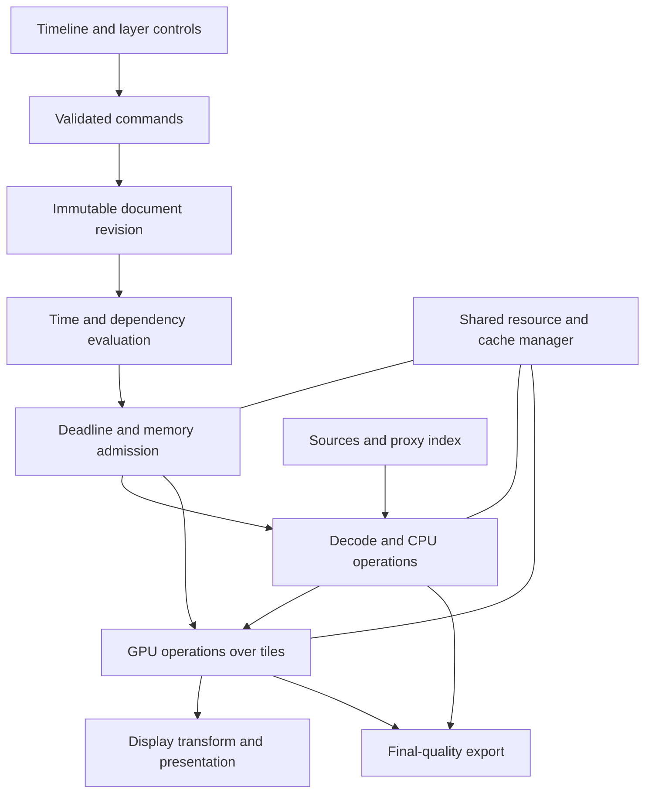

# Hardware optimization and future compositing architecture

## Recommendation

Build toward a hybrid CPU/GPU engine with one shared evaluation graph, bounded memory ownership, and different scheduling policies for interaction, playback, and export. Preserve the project's explicit exposure timing, command-based editing, color semantics, and independently verified output. Extend those foundations to video clips and audio through deliberate contracts rather than treating a video editor as a larger image-sequence compositor.

The Ryzen 9 9900X, 64 GB RAM, and RTX 4070 Ti Super are a credible development target for this architecture. They do not establish a guaranteed resolution, effect count, or frame rate. The current implementation leaves substantial opportunities in scheduling, data reuse, and presentation before hardware capacity becomes the only constraint. Maximizing useful work per second and minimizing interaction latency are better objectives than keeping every utilization graph at 100%.

For the broad ambition of combining After Effects-style compositing and motion design with Resolve-style editing and finishing, sustained GPU residency is a sensible strategic direction. For the immediate codebase, instrumentation and removing render-time editor locking are the first priorities. These recommendations are compatible: improve today's bottlenecks while testing the seams required by the larger engine.

This is research, not a replacement specification or implementation authorization. Its near-term mappings are R-06a/B-08 and R-06b/B-08b under T-06, with R-04/B-06, R-05/B-07, R-09/B-10, and R-10/B-02 affected by future rendering changes. Documents 06, 08, 12, 20, 21, 25, and 27 remain authoritative; ADR-006, ADR-011, ADR-015, and ADR-017 constrain adoption. Broad video editing and audio are future proposals, not newly accepted backlog items.

## Evidence and scope

Repository observations refer to commit `d609310a003a13a9af5b947210388dd23230685d`, inspected on September 9, 2026. Hardware capacity in the recommendations uses the supplied 64 GB configuration. Existing comments sometimes describe 32 GB, so old timing records must not be relabeled as fresh tests on the supplied configuration. Storage model, sustained throughput, installed GPU driver, display refresh, and actual available memory remain unverified.

The checkout advanced during research. A final comparison found no changes to the relevant source, build files, or declared T-06 measurement from that baseline. Document 14 now also contains **D-47**, recording the ten-layer performance gap as an open decision. Its cache limitation should be understood as applying to the existing decoded-source cache; caching completed effects or frames can eliminate work that this cache cannot.

Three evidence categories matter throughout: **observed code structure**, **previously recorded measurements**, and **proposed design or arithmetic**. No new compositor benchmark, GPU experiment, competitor benchmark, or rendering fixture run is reported here. The accompanying [research verification artifact](../verification/Research_33_evidence.md) records the checks performed and their limits.

Document 32 is a useful prior investigation. Its instructions and suggested spikes are treated as proposals to evaluate. Its biggest contribution is recognizing that decoding, conversion, copying, and whole-layer effects precede the small parallel tile loop. Its competitive explanations and several implementation details need correction before they guide investment.

Vendor behavior below is grounded in public documentation. The directly examined Resolve reference manual is version 20, July 2025, chapter 8; the downloaded Fusion manual identifies itself as **21.1, September 2026**, despite the search index labeling that rolling URL 20.3. These establish documented workflows, not the private implementation of every current Resolve subsystem. The sources do not establish blanket speed rankings between the two products.

## What the existing engine actually does

| Area | Source evidence | Performance implication |
|---|---|---|
| Media and layer preparation | `src/compose.rs`, `plan_frame_cached` and `resolve_layer` | Layers are prepared in order; cache access is mutable and synchronous. Independent source work is not broadly parallelized. |
| Decoded cache | `src/cache.rs`, `CelCache::decoded` | A hit clones the working pixel buffer; a miss clones it into storage. The current default is **1 GiB**, not the earlier 128 MiB. |
| Source mutations | `src/compose.rs`, mask and effect application | Masks and effects mutate the owned source. Sharing cache entries requires immutable inputs plus private outputs or copy-on-write. |
| Effects | `src/effects.rs`, `apply_stack` and Gaussian passes | Effects run before preview scaling, over source-space buffers. The Gaussian already uses two separable passes. |
| Render execution | `src/render.rs`, `render` and `render_tile` | Rayon distributes tiles; each tile visits layers, then its pixels. There is no layer/tile extent rejection in that loop. |
| Geometry precision | `src/render.rs`, `Affine` and `sample_bilinear` | Geometry uses f64 even though working pixels are f32. A GPU port is not solely an f32 arithmetic translation. |
| Preview scaling | `src/preview.rs`, `scale_plan` | Draft reduces a 1080p destination to 480 × 270 after source preparation. It cannot eliminate preceding full-size work. |
| Editor ownership | `app/src/main.rs`, `serve` | The viewer mutex stays held through preview rendering and output conversion. Commands using that mutex wait. |
| Presentation | `serve`; `app/ui/index.html`, `show` | Raw RGBA8 bytes cross to `ImageData`; there is already no PNG encode/decode round trip here. |
| Request policy | `index.html`, `inFlight`, `show`, `tick` | Only one frame fetch is in flight. Additional requests return immediately; this is not a latest-request mailbox or render cancellation. |
| Export | `app/src/main.rs`, `start_export`; `src/export.rs` | Export has a worker and captured job state. ADR-015 excludes the preview cache from export. |

The lock issue is a structural finding, not a measured freeze duration. A backend running on a worker thread can still delay editing if it holds the same lock as commands. Also, raw transport does not mean zero-copy: output conversion, response storage, the browser buffer, canvas submission, and eventual display still need measurement.

The renderer allocates tile buffers, then assembles them into a newly zeroed frame. Some copying may be removable, but a transparent accumulator is necessary somewhere. Eliminating a redundant initialization is different from reading uninitialized storage. This should be a safe ownership/layout change backed by existing tile-equivalence fixtures.

### The recorded performance gap

The checked-in [declared T-06 fixture](../verification/T-06_declared_fixture.md) contains ten raster layers, two alpha mattes, and exposure/blur/tint instances. It is rendered at draft output resolution, while the sources remain full size.

| Recorded item | Value | Interpretation |
|---|---:|---|
| 24 fps frame deadline | 41.667 ms | Target arithmetic, not a result |
| First loop median | 241.69 ms | Previously recorded engine work |
| Tenth loop median | 264.17 ms | Approximately 6.34 times the frame deadline |
| Tenth loop p95 | 319.42 ms | Long-tail engine time remains important |
| Loops completed within 10 seconds | 0 / 10 | Declared playback target not attained |
| Repeat-frame seek, 1 GiB cache, p95 | 207.57 ms | Repeating a frame still repeats substantial processing |
| Scattered seek, 1 GiB cache, p95 | 328.48 ms | Source cache alone does not meet the target |
| Recorded peak process working set | 1,435.8 MiB | A historical process measurement, not total machine demand |

Document 32 repeatedly quotes **267.17 ms**, which is not the tenth-loop median in the currently checked-in artifact. Use 264.17 ms when discussing that row. Nor is the reciprocal of a median the same as measured throughput: the first loop's 240 frames in 55.8752 seconds imply approximately **4.30 fps aggregate**, whereas 1,000 / 241.69 is approximately **4.14 fps**. Both calculations can be useful if labeled correctly.

The old artifact's “cold” loop does not establish cold physical storage: no operating-system file-cache purge is documented. Repeated loops with a 1 GiB decoded cache also are not equivalent to all source images being resident. Separate cold application cache, warm OS cache, warm decoded cache, warm effect cache, and warm presentation cache in future measurements.

The copied-art fixture is useful for regression tracking, but it is not representative of every ten-layer shot. PNG compressibility, transparency coverage, blur radii, frame-to-frame change, and source dimensions all affect cost. The claim that different artwork would not change any number is too strong.

## Lessons from After Effects and Resolve

### After Effects: reuse, throughput, and interaction are separate systems

Adobe documents Multi-Frame Rendering for preview and export, idle-time speculative preview, and a Composition Profiler for identifying expensive layers and effects. The SDK requires thread-safe effects to opt in; unsafe effects serialize entry and reduce scaling. The Compute Cache supports sharing expensive computed information. These are useful precedents for a scheduler and an effect capability contract. [1][2]

After Effects also documents reusable cached frames across undo, time remapping, duplicated layers, and duplicated compositions. Exposure-aware caching is therefore an opportunity for this project's explicit domain model, not an exclusive capability that Adobe cannot reproduce. [3]

The 25.2 release introduced High Performance Preview Playback using RAM and local disks together. An older paragraph on Adobe's memory page still says disk cache is not used for real-time previews; the dated 25.2 announcement supersedes that blanket characterization for the new playback system. A research report should resolve this version conflict rather than repeat the old limitation. [3][4]

**Design inference:** maintain independent goals for getting a new frame ready and presenting an already computed sequence smoothly. A complex frame can take longer than its playback interval to compute and still play smoothly once cached. Conversely, fast average rendering can feel bad if command handling, frame delivery, or cache misses have long tails.

Do not copy AE's historical constraints as design requirements. Keep a clear evaluator, immutable render inputs, and explicit effect dependencies from the outset. SmartFX already includes region/dependency mechanisms; saying AE's API declares nothing is inaccurate. [5]

### Resolve and Fusion: reduce work at the correct stage

Resolve 20 distinguishes Performance Mode, timeline proxy resolution, reduced raw decode quality, optimized media, proxy media, and render caches. These solve different bottlenecks. Chapter 8 also explicitly says that cached upstream color nodes can be reused while later nodes are adjusted; whole-grade caching has different invalidation consequences. Document 32's blanket claim that every edit flushes the whole clip misses this distinction. [6]

Fusion documents intersecting the requested region with the image's domain of definition. This avoids processing irrelevant areas and supports content beyond the nominal canvas. [7]

**Design inference:** preserve expensive source and upstream results when downstream controls change. Give a user distinct controls for processing resolution, proxy source selection, and cached playback, with clear quality provenance. Design one accountable resource manager across editing and compositing so caches compete under a common budget.

Resolve's public manuals do not justify inferring that it has no frame parallelism, that no subsystem can fall back to CPU, or that every GPU-memory problem is caused by a full-frame-only architecture. Similarly, different Fusion preference systems do not prove why one application is slower than another. Those statements require measurements or internal engineering evidence unavailable here.

### What to combine in this product

| Workflow strength to pursue | Supporting architecture | Observable success |
|---|---|---|
| AE-like layer animation and direct manipulation | Command snapshots; incremental property evaluation; reusable source/effect results | Dragging a transform responds while expensive work continues |
| Resolve-like timeline playback and trimming | Indexed media service; read-ahead; presentation queue; audio clock | Stable playback, prompt cuts and seeks, preserved A/V sync |
| Fusion-like selective compositing | Explicit graph dependencies and spatial/temporal support | Local edits avoid unrelated work without clipping halos |
| Reliable finishing | Shared color/effect semantics; immutable export manifests | Preview quality is explicit and final output remains verified |
| Understandable performance controls | Cache indicators, per-stage profiler, visible proxy state | The owner can identify the expensive operation without reading code |

This is an architecture direction, not a claim of AE project compatibility, OFX compatibility, a complete NLE, HDR support, or feature parity.

## Hardware capacity and resource policy

AMD specifies 12 cores and 24 threads for the 9900X. NVIDIA specifies 16 GB GDDR6X for the 4070 Ti Super. The system RAM and graphics memory are separate pools; their advertised capacities cannot simply be added into one fast image cache. [8][9]

### The image sizes that govern RAM and VRAM

The following values are uncompressed payload arithmetic. They exclude padding, allocation metadata, extra planes, mip levels, staging copies, and temporary effect storage.

| Resolution | RGBA8 | RGBA16F | RGBA32F |
|---|---:|---:|---:|
| 480 × 270 | 0.49 MiB | 0.99 MiB | 1.98 MiB |
| 1920 × 1080 | 7.91 MiB | 15.82 MiB | 31.64 MiB |
| 3840 × 2160 | 31.64 MiB | 63.28 MiB | 126.56 MiB |
| 7680 × 4320 | 126.56 MiB | 253.13 MiB | 506.25 MiB |

At 4K, ten RGBA32F sources consume about **1.24 GiB** before effects, mattes, temporal history, or outputs. A 240-frame 4K RGBA32F final-frame cache consumes **29.66 GiB**; RGBA8 presentation frames consume **7.42 GiB**. At 1080p those totals are **7.42 GiB** and **1.85 GiB**, respectively. Thus a display cache can offer smooth replay much more cheaply than keeping every final frame in working precision, provided its limited purpose and display transform are in its key.

For the prior report's 166 full-HD source cels, RGBA32F payload is approximately **5.13 GiB**, or **5.51 decimal GB**. At quarter width and height it becomes **0.321 GiB**. This makes reduced-resolution sources interesting, but capacity reduction is not a prediction of 16-fold end-to-end speedup.

**Proposed starting experiment, not a shipping default:** compare total application RAM ceilings around 32–44 GiB on the supplied 64 GB machine, with the remainder reserved for Windows, the webview, other applications, and emergency headroom. One 44 GiB example divides into 28 GiB reusable cache, 12 GiB admitted active work, and 4 GiB other application allocations. These are shared ceilings rather than allocations to fill immediately, and the measured process tree must fit the total. Reduce them when system pressure rises.

The current 1 GiB cel cache should not simply be replaced by that 28 GiB number. First prove what additional cached representation saves work. The existing repeat-frame measurement already shows diminishing returns from larger source-only caches.

For the GPU, test an initial application ceiling around 8–10 GiB, further capped by available OS budget and current usage. Windows exposes process video-memory budgets through DXGI and warns that exceeding them can cause stuttering from paging. A fixed “use all 16 GB” policy is inappropriate. [10]

Account for cache entries that have been evicted from the index but are still referenced by a render. Shared ownership reduces copying; it does not free a live buffer. Count retained buffers, in-flight outputs, decode surfaces, transfer staging, and pending GPU resources until their completion fences release them.

### CPU policy for the 9900X

Treat 24 logical threads as a tuning boundary, not a mandate to launch 24 frames. Test worker counts such as 1, 2, 4, 6, 8, 12, 16, 20, and 24 while recording throughput, p95 interaction latency, allocation volume, and memory pressure. SMT, cache locality, scheduling overhead, and bandwidth can change the best point.

Use one coordinated CPU-work budget across decoding, effects, tile execution, prefetch, and export. Independent oversized pools create contention. If separate pools are needed for priority isolation, their concurrency limits should still be jointly governed. Reserve scheduling headroom for commands, presentation, and audio; exclusive core affinity is a later measured experiment.

Start with layer/source parallelism for latency, then add bounded frame parallelism for throughput where frames are independent. Avoid holding the cache lock while reading files or decoding. Deduplicate in-flight requests for the same immutable source key, collect diagnostics privately, and publish them in stable order.

Preserve arithmetic order when applying SIMD across independent pixels. A vector lane count is not a measured speedup. Matrix sampling and memory access may dominate blend arithmetic. Compiler/native-CPU builds can be experiments, but distribution builds must retain documented portability and toolchain requirements.

### Storage policy

Do not prescribe a new SSD without knowing the current storage. Measure source reads, proxy generation, and cache read/write contention on representative media. A different folder or partition does not create independent device bandwidth.

Use disposable, versioned, bounded disk-cache storage with atomic completion and a free-space floor. Keep source files authoritative and keep caches out of project documents. Disk compression should be chosen by end-to-end read/decompress latency and fidelity, not compression ratio alone.

For scale, uncompressed RGBA8 presentation requires about **0.199 GB/s at 1080p24**, **0.796 GB/s at 4K24**, and **1.991 GB/s at 4K60**, before copies or filesystem overhead. RGBA32F is four times as much. These are payload rates, not SSD performance claims. A disk-cache hit can still miss a presentation deadline.

## Shared graph, separate execution policies

Keep the existing layer-oriented editing model. Compile layers, clips, effects, mattes, and eventual nested compositions into an internal directed acyclic graph. A node editor is a separate UI decision; users do not need to manage a graph to benefit from one.

The GPU export arrow describes a possible later capability, subject to numeric acceptance. Today export remains on its CPU path. Preview and export should share meaning and evaluation order even when scheduling differs.

Each operation should describe its inputs, color/alpha representation, output bounds, requested input region, temporal support, backend support, precision policy, determinism conditions, resource estimate, and cancellation boundaries. Time-invariant operations can omit irrelevant frame time from their reusable key; temporal operations cannot. Effect version and kernel/backend identity belong in cache provenance when outputs can differ.

OpenFX provides relevant precedents for declaring thread safety and cooperative abort. This is a source of contract ideas, not a recommendation to adopt plugin compatibility immediately. [11]

Derive each requested tile's dependencies backward through effects and transforms, then schedule ready operations. Preserve document 21's margins and evaluation order. Neighborhood filters may use halo tiles, strips, or another explicit bounded strategy. Temporal effects require both spatial regions and neighboring times; they cannot be treated as ordinary per-frame independent work.

Do not confuse a logical 128 × 128 render tile with a GPU workgroup. One logical tile can contain many 8 × 8 or 16 × 16 workgroups. Backend limits, occupancy, register use, and synchronization determine workgroup choices. Tune them independently. [12]

### Three scheduling modes

**Interactive editing:** a latest-request mailbox coalesces rapid scrubs and slider changes. Snapshot under a short editor lock, release it, and evaluate in workers. Requests carry revision, target time, quality, and request generation. Cancel obsolete work between bounded stages; discard obsolete display results even when cancellation arrives too late. Useful source results may still enter a correctly keyed cache.

**Playback:** prepare a small bounded queue ahead of the presentation clock. Begin with a shallow queue and measure; excessive read-ahead increases latency after a seek and wastes work. Distinguish a deliberately displayed held drawing from a dropped frame. Avoid rerendering the same target frame just because the monitor ticks faster than the timeline.

**Export and background caching:** use available CPU/GPU/memory capacity without starving interactive work. Bound the number of admitted frames by estimated live memory. Export can finish frames out of execution order only if ordered writing, error reporting, cancellation, and output manifests remain correct. A background job should yield when an interactive deadline is endangered.

A document snapshot alone does not freeze externally referenced media. A future immutable export manifest must identify source contents and define what happens if those files change during a job, through verified immutable copies or explicit change detection and failure. Do not promise reproducible export merely because the project model was cloned.

Audio later needs an independently serviced real-time path. Do not execute file reads, image decoding, general allocation, or renderer locks inside the audio callback. Prepare bounded audio buffers ahead of time and synchronize video to a declared audio/timeline clock. Windows provides low-latency audio APIs and driver-dependent buffer sizes; select and validate actual supported sizes rather than promising a universal latency. [13]

## CPU optimizations worth testing first

1. **Immutable decoded buffers with private effect outputs.** Share plain sources; copy only when a destructive operation needs ownership. Count both retained and writable allocations. Run the existing cache/mask fixtures to catch cross-layer contamination.
2. **A specialized byte-input color path.** For sRGB8 inputs, a 256-entry conversion table can replace repeated evaluation of the same transfer function. Preserve interpretation tags and premultiplication order. Generic float and future high-bit-depth inputs need their own paths. An implementation-generated table is not an independent expected-value fixture.
3. **Bounded independent source preparation.** Decode different required cels concurrently, deduplicate identical requests, and retain stable diagnostics. Measure file reading separately from PNG decompression, conversion, and copying.
4. **Cheap graph elimination.** Skip validated invisible/inactive work and parameter identities where semantics permit. Reuse a matte's prepared source if the complete dependency key matches. Its transform and coverage still need correct evaluation.
5. **Conservative spatial bounds.** Reject layers outside the tile after accounting for sampling footprint, effect expansion, transforms, and matte dependencies. Validate rotated thin artwork and edge halos. Alpha-derived bounds need a stronger invariant than alpha alone if an operation can create nonzero RGB at zero alpha.
6. **Reuse temporary storage and optimize loops after profiling.** Avoid redundant whole-image allocation; preserve required zero initialization. Specialize invariant blend/opacity/matte-presence paths where profitable. Matte coverage itself varies per pixel.

The sRGB inverse conversion is also part of preview: `serve` calls `to_srgb8_straight`. Document 32's claim that it belongs only to export is incorrect. Measure it at draft and full resolution. Replacing it by an approximate lookup or GPU implementation must satisfy an explicit quality contract.

These changes could overlap in savings, so their estimated benefits must not be multiplied together. If only a fraction of elapsed time is accelerated, the remaining fraction imposes a hard limit. For example, accelerating half a frame's work by ten times yields only 1 / (0.5 + 0.5 / 10) ≈ **1.82×** overall. This is arithmetic, not a prediction for this renderer.

## GPU strategy for the 4070 Ti Super

### Prove residency and presentation, not just a fast shader

The desired image path is source decode, upload or hardware-decode surface, color conversion, effects, sampling/mattes/blending, display transform, and presentation with as few CPU/GPU boundaries as possible. Keep intermediate images on the GPU. NVIDIA explicitly recommends minimizing host/device transfers even when an individual operation would be faster on the CPU. [14]

A compute-only tile port is useful for learning numeric behavior, but inadequate as the sole feasibility test. Extend the experiment to include uploads, the effect chain, resource synchronization, and actual presentation. Also test a stack with one unsupported CPU effect in the middle. The measured transfer and synchronization penalty should inform backend placement.

A WebView2 canvas cannot be assumed to consume a native GPU image handle from Rust automatically. Evaluate a native GPU viewer alongside the Tauri controls, or a supported bridge whose ownership, synchronization, color, DPI, resize, and device-loss behavior are demonstrated. Browser WebGPU and native wgpu are not automatically the same resource context. Retain raw RGBA transport as a useful baseline while measuring alternatives.

### Backend choice

| Candidate | Why investigate it | Main cost or uncertainty |
|---|---|---|
| Rust wgpu with WGSL kernels | Fits the Rust core; abstracts native backends; useful validation and resource model | Native video-surface and WebView2 presentation integration must be proven; portable feature limits apply |
| Native Direct3D 12 | Windows-specific control over compute, presentation, memory, and integration | More explicit synchronization and unsafe/platform-specific engineering |
| CUDA with graphics interop | Access to NVIDIA compute libraries and codec ecosystem | Vendor dependence, additional synchronization and distribution surfaces; not automatically faster end to end |

Start by comparing **wgpu/D3D12 and a native presentation path** against the current transport. Move to a lower-level backend only if a measured integration or performance requirement justifies it. wgpu documents supported backends and queried limits, but it does not make all hardware capabilities portable or remove integration work. [12][15]

Do not require every operation to be a compute shader. Compute is a reasonable starting point for explicit tile math and filters; graphics pipelines may be preferable for presentation or some operations. Neither route makes unsynchronized neighborhood read/write access safe. Blur generally needs distinct source/destination resources or carefully defined synchronization.

### Numeric compatibility is broader than float32

Three separate promises must remain distinct: deterministic repeats on the same build/backend; compliance with independent operation fixtures; and byte equality between CPU and GPU. The first does not imply the third. Fused multiply-add, reordered reductions, transfer functions, denormals, and sampling implementations can change results. [16]

The current CPU also uses **f64 transform coordinates**. WGSL's runtime floating-point types are f32 and optional f16, so a straightforward portable WGSL port changes coordinate precision. Computing an inverse on CPU in f64 and then uploading f32 coefficients does not preserve all f64 sampling results. Test large translations, near-singular scales, subpixel edges, rotation, and bilinear boundary cases. [17]

For the first experiment, use explicit interpolation and tagged FP32 resources rather than assuming hardware filtering or sRGB texture conversion exactly reproduces the CPU. wgpu format documentation describes automatic sRGB conversion and format capabilities; actual sampling support must be queried. [18]

Keep CPU final export initially while evaluating an explicitly identified GPU preview tier. Later GPU export must pass independently specified numeric and whole-image criteria. Document 21 already mentions simple GPU arithmetic tolerance of 1e-5, while other fixtures demand byte equality in particular contexts. Reconcile those scopes explicitly before acceptance; do not silently loosen existing fixtures.

FP16 may halve image payload, but it changes values and does not automatically double processing speed. Test low-alpha edges, repeated compositing, over-range exposure, blur, gradients, and 16-bit output. Similarly, fusing tint/exposure or changing blend grouping may change rounding even when the algebra looks equivalent. Precision choices are operation contracts, not global “fast mode” switches.

Tensor cores and ray-tracing cores are not generic accelerators for the current alpha compositor. They become relevant only for particular future algorithms. Avoid adding AI or 3D features merely to occupy hardware.

## Caching that supports both compositing and editing

Cache the earliest expensive reusable result appropriate to the edit. A transform drag should preserve decode and source-space effects. A downstream grade should preserve upstream work. A display-mode change should preserve working-space pixels. Repeated playback can reuse presentation-ready frames without claiming those bytes are authoritative export data.

Use a common memory owner for decoded images, source effects, transformed tiles, partial composites, and final presentation frames. Each entry needs byte cost, provenance, live references, readiness, and a recomputation-cost estimate. Start with a simple policy and compare against LRU; a more elaborate eviction algorithm only earns its place if it saves actual work.

Determinism alone does not make a cache key complete. Include relevant media identity, interpretation, time dependencies, masks/mattes, effect versions, backend/precision, and output interpretation. Path/mtime/size are inexpensive freshness hints but cannot prove content identity when bytes change without those metadata changing. Stronger identities can be computed during controlled import or background verification, subject to source-change detection and I/O cost.

An exposure hold guarantees source identity only while its source and interpretation remain unchanged. It does not guarantee the same final frame when transform, effects, matte, camera, lighting, or temporal samples change. Predicting which input a known next frame requires is exact; predicting whether the editor will request that frame is still speculative.

Stable-prefix caching is especially promising here if the unchanged bottom portion of a stack dominates cost. Cache the accumulator after that exact prefix, then execute the remaining layers in the original order. Do not arbitrarily regroup transparent blends: finite-precision operations and artistic blend modes can be order-dependent. Include upstream dependencies and replay diagnostics correctly on hits.

For a general editor, extend this to cached subgraphs and timeline spans. Keep invalidation separate from the document's global revision: the revision controls result freshness, while content/property keys allow reuse after undo or unrelated edits. Cache metadata growth itself needs a bound.

A future disk cache should support versioning, checksums, partial-file rejection, and safe deletion of disposable entries. It must never be required to reconstruct the project. Export-cache reuse remains a separate change to ADR-015; it should not arrive hidden inside a preview optimization.

## What broader video editing adds

### Media decoding and timeline semantics

The current PNG source service is not yet a general video pipeline. Add demuxing, stream metadata, keyframe indexes, presentation timestamps, decoder state, reverse-seek strategy, and bounded frame surfaces behind a media interface. Keep source time distinct from timeline time and from audio sample position. Variable-frame-rate inputs need an explicit timestamp-to-timeline policy.

Hardware decode is selected by codec, profile, bit depth, chroma format, dimensions, and available driver/API support. NVIDIA's matrix lists the 4070 Ti Super's supported video paths; Ada should not be assumed to support the newer 4:2:2 paths advertised for Blackwell. PNG is outside NVDEC's listed codec set. Unsupported formats need explicit CPU decode or proxy generation. [19]

NVENC accelerates supported video encoding, not arbitrary image effects or this application's PNG output. Two encoding engines do not guarantee twice the end-to-end export rate. Decode, render, colorspace conversion, transfers, and muxing can each dominate.

FFmpeg is a candidate media layer, not an adopted dependency. Its hardware-decode example explicitly transfers GPU frames back to system memory for its output purpose; copying that sample's path into a compositor would sacrifice residency unless deliberately redesigned. Its build configuration also affects license obligations, which need to be recorded before distribution. [20][21]

### Proxies and editing responsiveness

Offer source proxies for expensive decode and a separate processing-resolution control for expensive effects. Proxy generation should be a cancellable background job, keyed to source identity, interpretation, dimensions, and generation settings. Editing must retain links to originals and state when a proxy is being viewed.

For cel art, any reduced source representation needs correct premultiplied-linear downsampling and expanded bounds. For video, common opaque YUV proxies cannot preserve arbitrary alpha or every HDR/working-space value. The proxy format must match the intended fidelity tier. A faster representation that silently discards alpha is a correctness defect.

Long-GOP footage adds seek work because a requested picture may depend on earlier reference pictures. A dedicated decode queue and seek index help; arbitrary frame-level parallelism inside a single decoder is not a universal solution. Test actual camera/screen-recording samples and software-decoded fallbacks, not just one friendly codec.

### Audio, UI scale, and advanced features

A future editor needs waveform/thumbnail generation away from the UI thread, viewport-limited timeline rendering, and incremental updates instead of rebuilding all panels on every playhead movement. Test thousands of clip/keyframe objects separately from pixel rendering; low GPU use can coexist with a slow interface.

Temporal denoise, optical flow, stabilization, motion blur, text/vector rasterization, 3D, tracking, and expressions each need their own spatial/temporal and resource contracts. Temporal effects can require many neighboring frames and invalidate reuse across a wider interval. Expressions require bounded execution, explicit inputs, and deterministic seeds where randomness is allowed.

Color management should remain centralized across source decode, graph processing, display, proxies, and output. OCIO offers GPU shader support if the product later adopts it; it does not by itself guarantee CPU/GPU equivalence or correct monitor presentation. HDR is a complete output/display policy, not merely choosing a float texture. [22]

A sensible expansion order is basic clip timing and audio, then reusable compositing/grade subgraphs, then expensive temporal or 3D tools. This creates useful intermediate products and keeps each new feature's performance obligations visible.

## Proposed experiments and acceptance evidence

The identifiers below are research proposal labels, not additions to the accepted backlog. Before implementation, assign accepted task IDs and resolve applicable contract changes. Every numerical expected value must be independent of the implementation being tested; baseline comparisons are supplementary regression evidence.

| Proposal | Existing mapping or decision | Experiment and deliverable |
|---|---|---|
| PERF-R01: complete frame trace | R-06a/B-08, T-06; documents 06/08 | Timestamp input, command/lock wait, planning, cache, file read, PNG decode, conversion, mask, each effect, tiles, assembly, display conversion, delivery, and presentation. Include a raw trace and p50/p95/p99 table. |
| PERF-R02: responsive ownership | R-06a and R-07; document 06 snapshot contract | Short editor-lock snapshot, bounded latest-request scheduling, cancellation, stale-result rejection. Demonstrate rapid drag/undo while slow work is in flight with event logs and a screen recording. |
| PERF-R03: source preparation | R-06b/B-08b; B-02/B-06/B-07 | Compare immutable sharing, byte conversion specialization, and bounded concurrent decode separately. Show unchanged independent fixtures, copies/bytes, cache lifetime, and end-to-end latency. |
| PERF-R04: reusable expensive stages | ADR-015 scope decision; document 27 | Compare source-effect cache and presentation-frame cache against decoded-only cache. Test changes, undo, missing/replaced media, quality switches, diagnostics, and eviction. |
| PERF-R05: bounded spatial execution | ADR-011/017; document 21 | Test conservative culling, tile sizes, storage reuse, and later effect halos. Export edge/halo PNGs with expected-versus-actual differences. |
| PERF-R06: reduced source quality | R-06a; preview quality decision | Compare current draft with reduced sources using specified filtering. Report memory, timing, low-alpha/line-art differences, and unchanged final export. |
| PERF-R07: GPU vertical slice | ADR-006 reopening; documents 21/25 | Decode/upload, effects, transformed matte, blend, display, and one CPU fallback boundary. Record GPU timings, transfers, memory, numeric differences, and actual screen latency. |
| PERF-R08: video/audio feasibility | New media/time scope; documents 07/20/23 | Representative codec matrix, seeking/reverse playback, proxy fallback, A/V sync, and immutable export manifest. Fixtures precede implementation. |

PERF-R01 extends document 32's SP-P1 through the actual display boundary. PERF-R07 extends SP-P5 beyond one kernel. The source-sharing and cache proposals must be evaluated with masks/effects present, rather than validating only a plain source.

### Workload matrix

Retain the original four-layer shot and the declared ten-layer fixture as separate regression cases. Add independently specified workloads for a large static background with moving overlays; continuous transforms over held cels; dense full-frame effects; large blur halos; rapid random seeks and undo; and source replacement during active work.

For the broader product, add 4K video with supported hardware decode, a difficult CPU-decoded profile, variable-frame-rate footage, mixed-frame-rate cuts, audio, and a temporal effect. Include long timelines with many clips even when pixel complexity is low. Each workload must say what feature is implemented before it is used to judge performance.

Measure the application process tree, CPU usage, decoder activity, GPU compute/copy/video engines, live VRAM allocation, OS budget, hard faults, and cache hit/miss/eviction counts. GPU utilization should be broken down by engine. Nsight Graphics can profile graphics/compute work; CPU and application traces must cover the rest. [23]

### Targets and measurement discipline

Keep document 08's existing 24 fps playback, p95 cached seek-to-display ≤100 ms, and bounded repeated-loop memory targets. Their current status must remain separate from newly proposed goals.

As proposed interaction goals, investigate p95 command acknowledgment ≤16 ms and p95 useful drag preview ≤50 ms under a declared interactive workload. These are design targets, not measured capability or universally appropriate thresholds. At 60 fps the video deadline is 16.667 ms, so meeting a 100 ms seek target does not establish 60 fps rendering.

Use release builds with recorded compiler, commit, driver, resolution, quality, tile/workgroup settings, cache state, and worker count. Alternate baseline/candidate runs to reduce thermal/time-order bias. Record distributions and total elapsed throughput, not just best runs or reciprocal medians. Ten loops are a minimum regression scenario, not proof against all memory leaks.

Parallel stage durations overlap: summing CPU time from concurrent tasks can exceed wall time. Record both per-stage service time and critical-path wall time. Browser submission is not physical presentation; label software display estimates and supplement them with frame-presentation tracing or a high-frame-rate screen/camera test when claiming input-to-visible latency.

Numeric acceptance needs simple independent fixtures plus difficult whole images, multiple tile sizes/worker counts, cache-on/off behavior, cancellation/undo races, and exported PNGs. CPU-vs-GPU agreement alone is insufficient because both can implement the same mistake.

## Contract changes needed before adoption

| Proposed change | Constraint | Smallest explicit decision |
|---|---|---|
| GPU backend | ADR-006 accepts CPU-only G1 and a measurement-based reopening trigger | Reopen for a bounded GPU feasibility experiment; do not imply production GPU export approval |
| Effects/frame cache and export reuse | ADR-015 limits the promoted cache to decoded cels and excludes export | Extend preview cache scope separately; decide export reuse only after its own evidence |
| Reduced sources, FP16, approximate conversion | Documents 08/21/25 and preview quality semantics | Define the precise tier, filtering/precision, quality label, and independent acceptance values |
| Effects evaluated within tiles | ADR-017 whole-layer effects | Replace that decision only with an explicit halo/bounds contract and new independent fixtures |
| Video/audio editor scope | Documents 01–04/07/20/23 | Accept incremental media/time requirements and schema migration fixtures before implementation |

The historical T-06 gap justifies examining GPU feasibility, but a report cannot mark ADR-006 automatically reopened or replace the owner's scope decision. Likewise, evidence that a preview differs from export does not authorize arbitrary new differences.

A source-only performance refactor that preserves contracts can be small. The long-term ambition is larger: one graph and resource model should support increasingly capable workflows, with verified CPU semantics and a measured GPU path. Start by making the current app explain where time goes and respond promptly to edits; then prove reuse and residency against the supplied hardware.

## Sources

All web sources were accessed September 9, 2026. Rolling documentation may change; versions/dates are identified where material. Local source references are pinned by the repository commit in the evidence section. Source citations establish documented capabilities; architecture prescriptions are this report's analysis.

1. Adobe. [Preview and render with Multi-Frame Rendering](https://helpx.adobe.com/after-effects/desktop/render-and-export/multi-frame-rendering/multi-frame-rendering.html). Rolling help; MFR, idle preview, profiler.
2. After Effects C++ SDK Guide, Adobe SDK documentation hosted by Docs for Adobe. [Multi-Frame Rendering in AE](https://ae-plugins.docsforadobe.dev/effect-details/multi-frame-rendering-in-ae/). Thread safety, serialization, Compute Cache.
3. Adobe. [Memory and storage](https://helpx.adobe.com/after-effects/desktop/memory-storage-performance/memory-and-storage/memory-storage1.html). Reuse across time/undo/duplication; contains legacy preview wording qualified above.
4. Paul Saccone, Adobe. [Premiere Pro and After Effects 25.2](https://blog.adobe.com/en/publish/2025/04/02/introducing-new-ai-powered-features-workflow-enhancements-premiere-pro-after-effects). April 2, 2025; High Performance Preview Playback.
5. After Effects C++ SDK Guide. [SmartFX](https://ae-plugins.docsforadobe.dev/smartfx/smartfx/). Region and pre-render contracts.
6. Blackmagic Design. [DaVinci Resolve 20 Reference Manual](https://documents.blackmagicdesign.com/UserManuals/DaVinci_Resolve_20_Reference_Manual.pdf). July 2025, chapter 8, pp. 191–217; especially pp. 194–195 and 201–204. Original PDF downloaded and chapter text examined because web extraction exceeded its size limit. Newer 20.3 manuals are listed on the vendor support site; no claim that this is the newest manual.
7. Blackmagic Design. [Fusion Reference Manual](https://documents.blackmagicdesign.com/UserManuals/FusionManual.pdf). Downloaded cover: 21.1, September 2026; search index: 20.3. Rolling URL; viewer ROI p. 21 and optimization/DoD p. 211, using one-based PDF pages. Original PDF downloaded and relevant sections examined.
8. AMD. [Ryzen 9 9900X specifications](https://www.amd.com/es/products/processors/desktops/ryzen/9000-series/amd-ryzen-9-9900x.html). 12 cores/24 threads; product specification.
9. NVIDIA. [GeForce RTX 4070 family specifications](https://www.nvidia.com/en-eu/geforce/graphics-cards/40-series/rtx-4070-family/). 4070 Ti Super memory configuration.
10. Microsoft. [IDXGIAdapter3::QueryVideoMemoryInfo](https://learn.microsoft.com/en-us/windows/win32/api/dxgi1_4/nf-dxgi1_4-idxgiadapter3-queryvideomemoryinfo). February 22, 2024; process budget and oversubscription behavior.
11. Academy Software Foundation/OpenFX. [Rendering](https://openfx.readthedocs.io/en/main/Reference/ofxRendering.html). OpenFX 1.5.1 documentation; threading and interactive abort.
12. wgpu project. [Limits](https://docs.rs/wgpu/latest/wgpu/struct.Limits.html). Rolling API documentation; query supported limits before dispatch/resource decisions.
13. Microsoft. [Low Latency Audio](https://learn.microsoft.com/en-us/windows-hardware/drivers/audio/low-latency-audio). Driver-dependent buffers and audio APIs.
14. NVIDIA. [CUDA C++ Best Practices Guide](https://docs.nvidia.com/cuda/cuda-c-best-practices-guide/index.html). Sections on host/device transfer and memory optimization; principles applied here without adopting CUDA.
15. wgpu project. [wgpu crate documentation](https://docs.rs/wgpu/latest/wgpu/). Supported backend abstraction; exact dependency version remains unselected.
16. NVIDIA. [Floating Point and IEEE 754](https://docs.nvidia.com/cuda/floating-point/index.html). Operation order, FMA, CPU/GPU comparisons.
17. W3C. [WebGPU Shading Language](https://www.w3.org/TR/2026/CRD-WGSL-20260831/). Candidate Recommendation Draft, August 31, 2026; runtime floating-point types and arithmetic.
18. wgpu project. [TextureFormat](https://docs.rs/wgpu/latest/wgpu/enum.TextureFormat.html). Formats, conversion semantics, and feature-dependent capabilities.
19. NVIDIA. [Video Encode and Decode Support Matrix](https://developer.nvidia.com/video-encode-decode-support-matrix). RTX 4070 Ti Super rows; codec/profile support is distinct from shader processing.
20. FFmpeg. [Hardware decoding example](https://ffmpeg.org/doxygen/trunk/hw_decode_8c-example.html). Hardware surfaces and explicit transfer to system memory.
21. FFmpeg. [License and Legal Considerations](https://ffmpeg.org/legal.html). Build-dependent obligations; not a license determination for a future distribution.
22. OpenColorIO. [Shaders](https://opencolorio.readthedocs.io/en/latest/api/shaders.html). GPU color-transform integration.
23. NVIDIA. [GPU Trace Overview](https://docs.nvidia.com/nsight-graphics/UserGuide/gpu-trace-overview.html). GPU profiling scope and capabilities.

Local evidence: `Markdown/32_Performance_Architecture_Investigation.md`; `verification/T-06_declared_fixture.md`; `verification/T-06_performance_envelope.md`; `verification/B-08b_cache_budget.md`; source functions in the code-evidence table; governing documents and ADRs listed in the opening sections. Local artifacts are historical records unless explicitly labeled as new checks in the research verification artifact.
