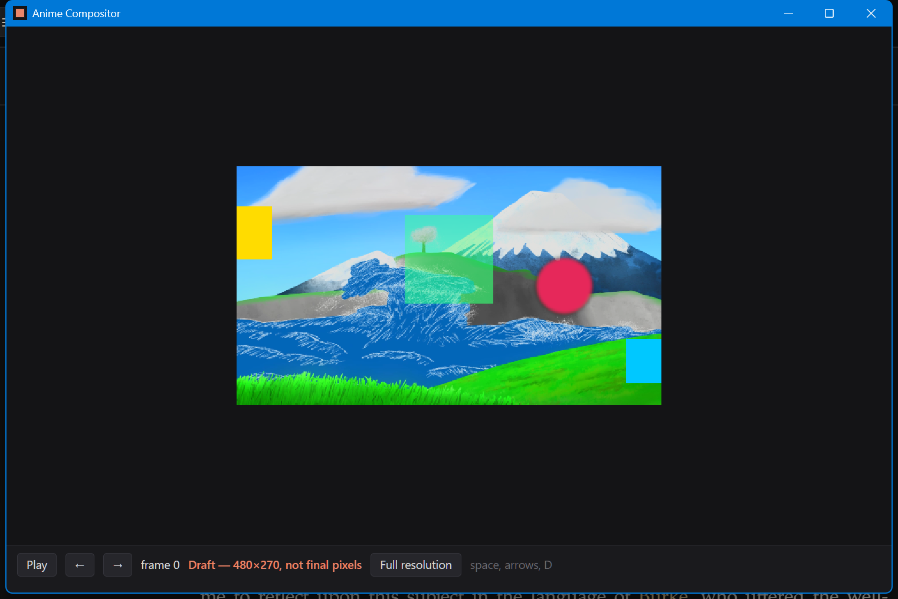
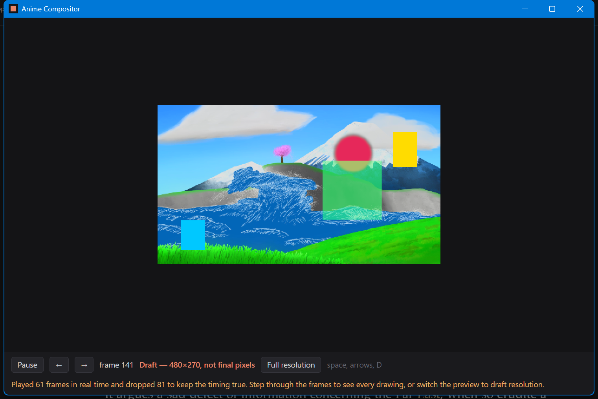
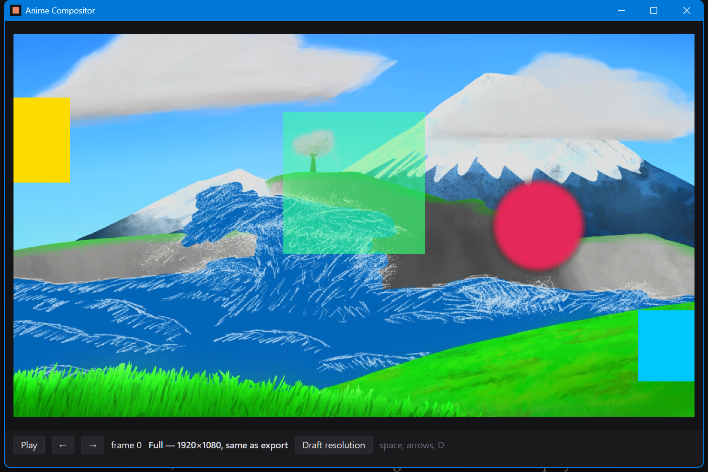

# B-08, the viewer

Three photographs of the application running, and between them they are the whole of what a
window adds to what the fixtures already proved: that a frame reaches a screen, that the clock
runs in real time, and that the resolution on screen is named on screen.

## 1. At rest



Frame 0 of the reference shot, at draft resolution, in a window. D-35: at rest the viewer shows
the work area's first frame.

The indicator beside the frame number reads **Draft — 480×270, not final pixels**, and it is
coloured. That is R-06a's "visible indication when preview quality differs from final export",
and D-33's condition for making draft the default. It is not a label the page keeps for itself:
it is built from headers that came back with the pixels, so it cannot describe a resolution other
than the one it is standing next to.

## 2. Playing



The space bar started playback and this was taken about six seconds later. The sentence along the
bottom is `Playback::report`, unchanged, in the words document 28 asks for:

> Played 61 frames in real time and dropped 81 to keep the timing true. Step through the frames
> to see every drawing, or switch the preview to draft resolution.

**That is D-32 working, not failing.** 61 shown and 81 dropped across 142 frames of clock is
about 97 ms of wall clock per frame delivered, against the 41.7 ms a 24 fps shot allows. The
renderer is the reason and it was measured before the window existed:
`B-08_preview_latency.md` puts a draft frame at 81.69 ms median on this machine, three quarters
of it decoding cels. The viewer holds real time and says out loud what that costs. A viewer that
played all 142 frames late would have been a silent fidelity fallback, which document 28 forbids.

The count is honest in both directions: it is produced by the same `Playback` the fixture table
in `B-08_preview_table.md` checks, and the page cannot reach it. Nothing in the window decides
which frame to show or how many were missed — it supplies an instant and is told.

## 3. Full resolution



Pressing D switched the preview to full resolution and the indicator changed with it:
**Full — 1920×1080, same as export**, no longer coloured, because there is now nothing to warn
about. `B-08_preview_table.md` is what makes that sentence a fact rather than a claim — a
full-resolution preview of frame 100 and an export of frame 100 differ in 0 of 8,294,400 samples.

## What is in the picture and what is behind it

The window is a Tauri shell in its own crate; every frame in these pictures was composed by
`anime_compositor` and the shell cannot compose one. Frames arrive over a custom URI scheme
(D-36) as raw 8-bit sRGB samples — the same bytes an export writes, without the PNG container,
because encoding one here would cost a fifth of a frame budget to have the webview immediately
undo it. Everything the bar says travels in headers on the same response.

The checkerboard behind the frame is the page, not the composition: it is there so a transparent
frame reads as transparent rather than as black.

## How these are made, and why they are the odd ones out

Everything else under `verification/` is written by `cargo test`, and CI runs
`git diff --exit-code -- verification/` to require that the committed copy still matches what the
build produces. These three are not, because a window is not a value a test can compare and CI
has no screen to open one on. They are captured by `tools/capture_window.ps1`:

```
cargo build -p anime_compositor_app --release
powershell -ExecutionPolicy Bypass -File tools/capture_window.ps1
powershell -ExecutionPolicy Bypass -File tools/capture_window.ps1 -Name B-08_window_playback -Keys " " -Settle 6000
powershell -ExecutionPolicy Bypass -File tools/capture_window.ps1 -Name B-08_window_full -Keys "d"
```

**Release, deliberately.** The same three pictures taken from a debug build report 6 frames
played and 97 dropped, which is a fact about `opt-level = 0` and not about this renderer;
`B-08_preview_latency.md` records its own numbers under the same rule.

These files are not compared byte for byte by anything, and they will not reproduce exactly:
window placement, display scaling, the theme of the title bar and the frame playback happens to
reach are all properties of the machine and the moment. Captured at 1522×1016 physical pixels —
the window asks for 1000×640 on a display running at 150%. They are evidence that the viewer ran
on 2026-09-05, not fixtures.

## What is checked automatically, and what is not

The shell is a workspace member, so every CI gate covers it: it builds, it passes clippy with
warnings denied, its request parsing has unit tests (`cargo test -p anime_compositor_app`), and
its 264 dependencies are recorded and archived. What no gate covers is whether the window opens
and whether a frame appears in it. This file is why that gap is visible rather than silent.
