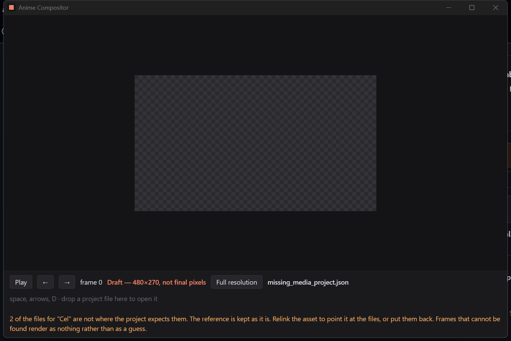
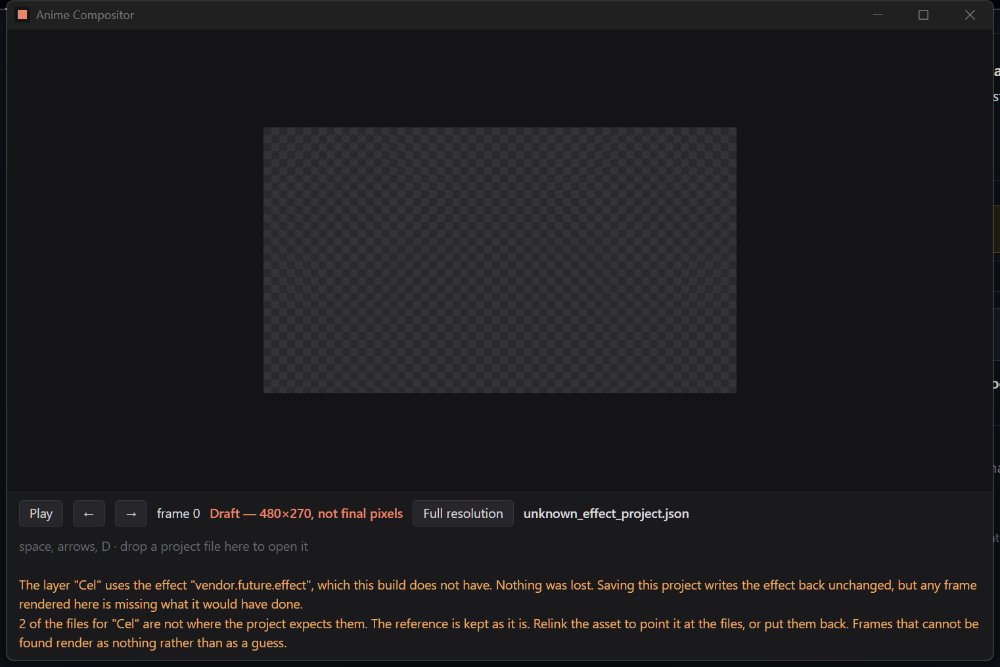
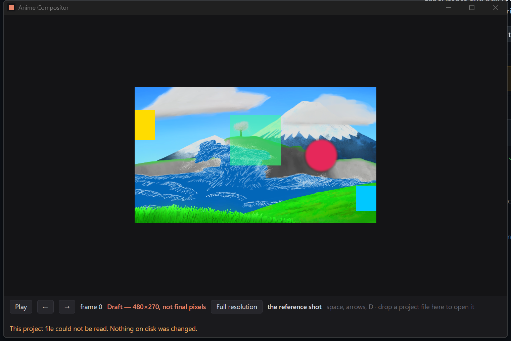

# B-09, opening a project in the viewer

Until now the window showed one project, named in the source. It can now be given one — on the
command line, or by dropping the file on the window — and these three photographs are what that
looks like when the project is fine, when it is not, and when it is not a project at all.

The point of all three is the same: **the window says which project is on screen and what the
core said about it.** Document 28 asks that unsupported or missing data is preserved or
diagnosed and never silently substituted. A viewer is where that promise is either kept in front
of a person or quietly broken, because a viewer is a picture and a picture always looks
finished.

## 1. A project whose media is not where it says



`Fixtures/projects/missing_media_project.json`, opened by name. The bar says
**missing_media_project.json**, and underneath it, in the core's words:

> 2 of the files for "Cel" are not where the project expects them. The reference is kept as it
> is. Relink the asset to point it at the files, or put them back. Frames that cannot be found
> render as nothing rather than as a guess.

And the canvas shows the checkerboard, which is the page's way of drawing transparency, because
that is what the frame is: nothing. **Nothing is exactly right here.** A missing cel that came
back as black, or as the previous frame, or as a placeholder graphic, would be a frame that
looks like a decision somebody made. The reference in the project file is untouched — this is a
viewer, it does not repair anything — so relinking or putting the files back is still possible
and still means what it meant.

## 2. A project using an effect this build does not have



`Fixtures/projects/unknown_effect_project.json`. Two warnings now, and the first is the one that
matters:

> The layer "Cel" uses the effect "vendor.future.effect", which this build does not have.
> Nothing was lost. Saving this project writes the effect back unchanged, but any frame rendered
> here is missing what it would have done.

That is document 28's unknown-data rule with both halves said out loud: the data survives a
round trip, **and** the person is told that the picture in front of them is not the whole
project. Either half alone would be a lie of a different kind.

## 3. Something that is not a project



`Markdown/CONTEXT.md`, handed to the viewer on purpose. The reference shot **is still on screen**
and still says it is the reference shot; the only thing that changed is the line underneath:

> This project file could not be read. Nothing on disk was changed.

Closing a working project because the next thing dropped on the window was unreadable would take
away the person's place to punish them for a bad aim. So a failed open changes nothing except
what the window is saying.

## What is behind the pictures

Opening a project is `persist::load` and nothing else. The shell does not parse a project, does
not decide what a warning means, and does not write its own sentences: every line in the yellow
list is a `Diagnostic` from the core, its message followed by its remediation, in the order the
core produced them. That is why these photographs are evidence about the *core's* behaviour and
not about the window's.

Media resolves against the project file's own directory, which is the rule `persist::load`
checks missing media against, so what the viewer renders and what it warns about are the same
set of files. (The one project that does not follow that rule is the built-in reference shot,
whose file `cargo test` writes into `verification/` while its cels live under
`Fixtures/reference_shot`; `demo()` in `app/src/main.rs` overrides its media root for that
reason and says so. It is the last thing in the shell that knows a path.)

The project name and the warnings travel as **percent-encoded headers** on every frame response,
along with the frame number and the resolution indicator. Percent-encoded because a header is
bytes and a project or a path can be Japanese — `media/背景/夜空.png` is in the fixtures on
purpose — and a diagnostic that arrives as mojibake tells the person the wrong filename, which is
worse than telling them nothing. `cargo test -p anime_compositor_app` checks that encoding
against UTF-8 worked out by hand.

## How these are made

```
cargo build -p anime_compositor_app --release
powershell -ExecutionPolicy Bypass -File tools/capture_window.ps1 -Name B-09_open_missing_media -Open "Fixtures\projects\missing_media_project.json"
powershell -ExecutionPolicy Bypass -File tools/capture_window.ps1 -Name B-09_open_unknown_effect -Open "Fixtures\projects\unknown_effect_project.json"
powershell -ExecutionPolicy Bypass -File tools/capture_window.ps1 -Name B-09_open_refused -Open "Markdown\CONTEXT.md"
```

Same rules as `B-08_window_shell.md`: these are not written by `cargo test`, they will not
reproduce byte for byte, and they are evidence that the viewer ran on 2026-09-05.

## What these pictures do not show

**The drop itself has not been photographed.** A script can start the window on a project; it
cannot drag a file onto it. What the pictures show is `take`, the function a drop calls, reached
the only other way it can be reached — the command-line argument goes through exactly the same
function, so everything after the operating system hands over a path is covered. What is not
covered is the operating system handing over the path: that is `WindowEvent::DragDrop` in
`app/src/main.rs`, it is four lines, and until someone drops a file on the window nobody has
seen it work.

There is also still no way to *save* from the window, no file dialog, and no recent-projects
list. Opening is one direction only.
