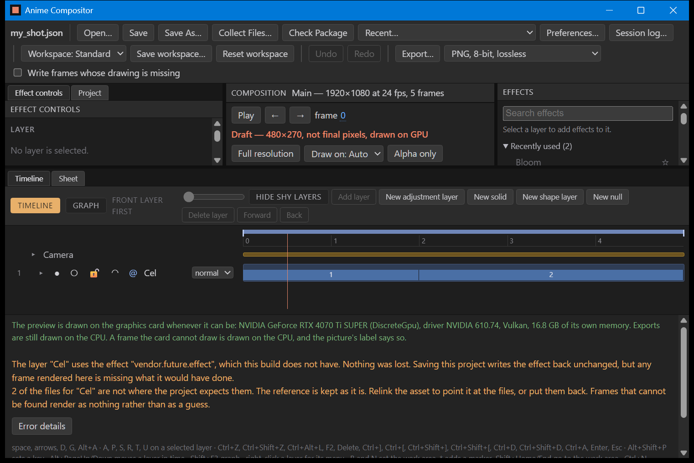

# B-113: the web view's own network traffic, narrowed

Written on 2026-09-27 against D-173, which is **proposed** and waits for the owner. This continues
`verification/B-11_offline_run.md`. That file found Microsoft's web view, running inside the
window, holding four connections off this machine while the window sat idle.

## What was changed

Two more Chromium switches in `app/src/main.rs`, set before the window is created:

- `--host-resolver-rules="MAP * ~NOTFOUND , EXCLUDE *.localhost"`: every name except
  `*.localhost` cannot be looked up. The page only ever asks for `frame.localhost` and
  `project.localhost`, which the web view answers inside the process.
- `--proxy-server=127.0.0.1:9`: every other web request is sent to a port on this machine where
  nothing listens, so it fails straight away.

The page never asks for anything else, so neither switch should change what you see. The picture
below checks that.

## How it was watched

The same way as B-11, on the release build, with nobody touching the window:

```
cargo build -p anime_compositor_app --release
powershell -ExecutionPolicy Bypass -File tools/offline_check.ps1 -Open "target\shot\my_shot.json" -Seconds 30
```

It was run three times, one after another. This machine's own address is left out below.

## What came back

| Run | Connections held | Off this machine | Where to |
|---|---|---|---|
| B-11, before (2026-09-05) | 16 | 4 | 2 to the internet provider's DNS service, 2 to a Microsoft address |
| 1 | 12 | 2 | `2603:1036:30c:5::2`, port 443 |
| 2 | 12 | 2 | `2603:1036:30c:c82::2`, port 443 |
| 3 | 12 | 2 | `2603:1036:903:47::`, port 443 |

The other ten connections in each run are the same kinds B-11 described:

- sockets reserved but not connected;
- attempts on port 80 of this machine that never connected.

`anime_compositor_app.exe`, the program itself, held **no** connection in any run, as in B-11.

## What it means

- **The DNS-over-HTTPS connection is gone.** The switch B-11 tried for it did not remove it; the
  name rules did.
- **The Microsoft connection is still there, in every run.** The addresses are in `2603:1036::`,
  which is Microsoft's. The last part changes from run to run, as B-11 saw.
- **No switch can reach it.** Every request that goes through Chromium's own network code is sent
  to the dead proxy and fails. This one connected straight to Microsoft anyway. So it is made by
  something in the web view outside Chromium's network code, where these switches do not apply.

So the answer to B-113 is: narrowed from four connections to two, and the two that are left are
out of this program's reach. The three choices in D-39 are still the owner's. They are listed in
D-173.

## The window still works



`B-113_window_with_switches.png` was taken by `tools/capture_window.ps1` on the same project with
the switches on. The page drew, and it talked to the program. You can see this because:

- the file name is in the top left;
- the graphics card report is in the green text;
- the project's own warnings are in orange. That project's drawings are missing on purpose.

A page cut off from the program shows none of these.

## To check it yourself

1. Open the program on any project. Scrub, play and export. Nothing behaves differently from
   before.
2. Optional: run the `offline_check.ps1` line above in PowerShell from the project folder. The
   last lines list what the web view held. One Microsoft address, on port 443, twice, is what to
   expect.

## Result

Not yet played.
