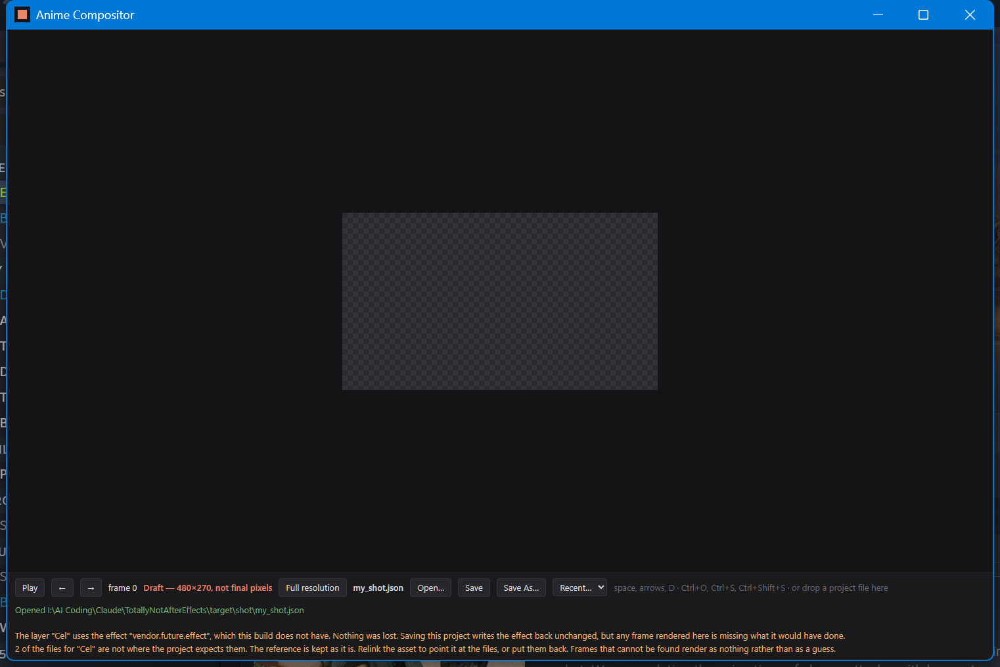
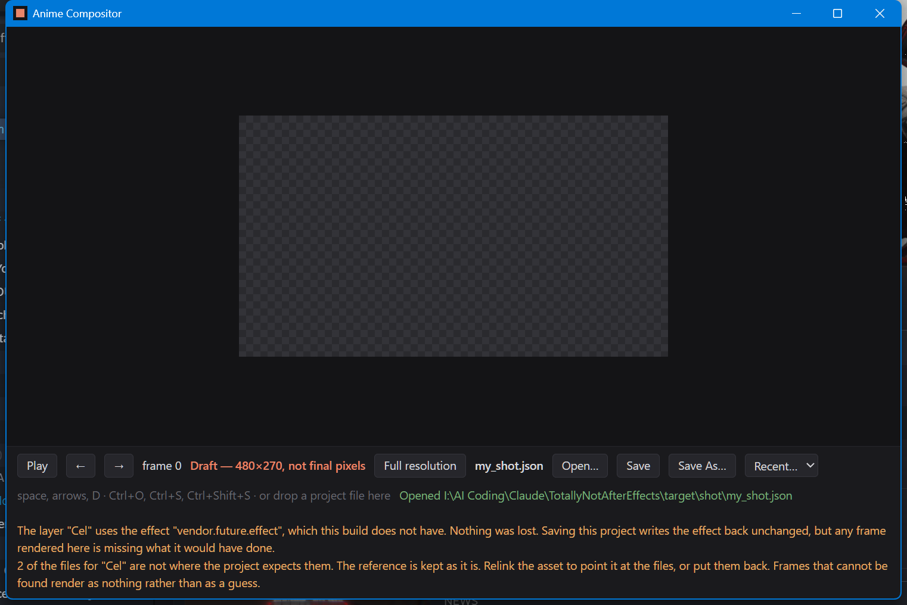
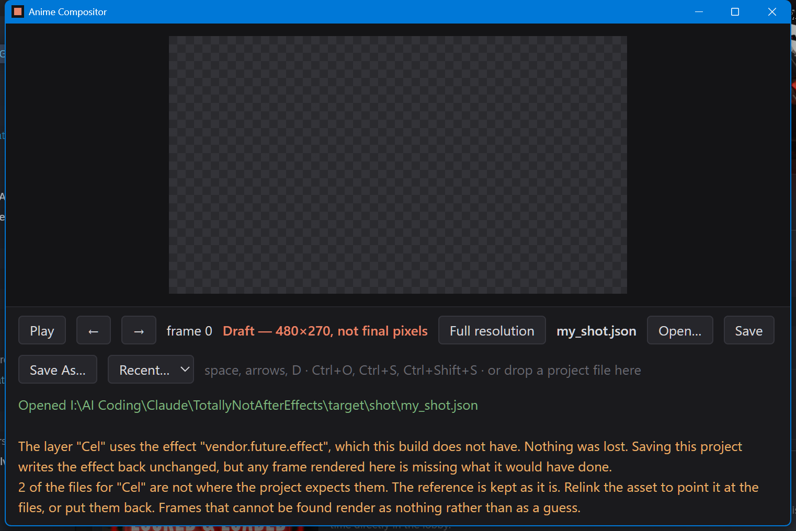
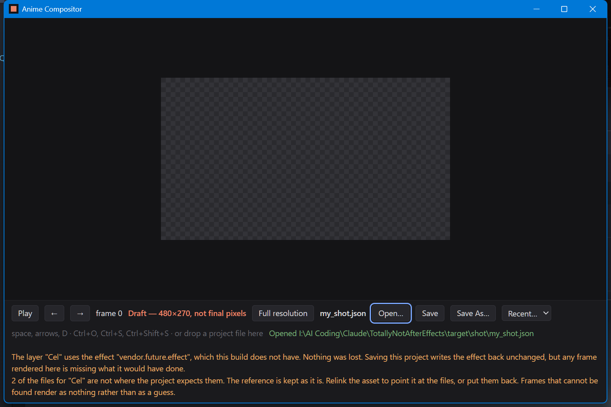
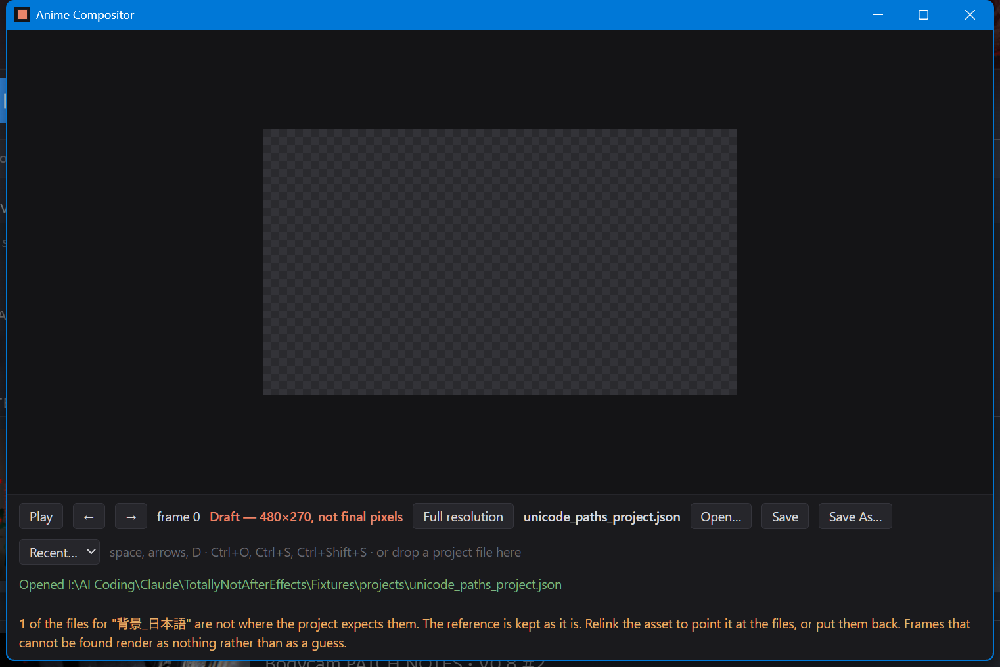

# B-11, display scaling, the keyboard, and non-English text

Q-03 asks that the interface stay usable when Windows is set to enlarge text, that every control
be reachable from the keyboard, and that text which is not English display correctly. None of
those three is a value a test can compare, so this is five photographs and an account of what
they show — including two layout defects and one keyboard defect that these checks found and
that are now fixed.

## 1. Display scaling

| Photograph | Scale | What the bar does |
| --- | --- | --- |
|  | 100% | every control on one row, the hint and the status beside them |
|  | 150% | wraps to two rows, warnings below |
|  | 200% | wraps to two rows at twice the size; the picture is smaller and still whole |

All three are the same project at frame 0, and the two warning lines are the same two sentences
in each. Read down the column and the thing to check is that nothing is cut off, nothing is
overlapped, and the checkerboard — the frame itself — is on screen in all three.

**This machine's own display is already at 150%.** Every other photograph under `verification/`
was taken at that setting, so the 150% row is not a simulation of anything; it is the ordinary
case. The 100% and 200% pictures were made by telling the web view what device scale factor to
render at:

```
powershell -ExecutionPolicy Bypass -File tools/capture_window.ps1 -Name B-11_scale_100 -Open "target\shot\my_shot.json" -Scale 1.0
powershell -ExecutionPolicy Bypass -File tools/capture_window.ps1 -Name B-11_scale_150 -Open "target\shot\my_shot.json" -Scale 1.5
powershell -ExecutionPolicy Bypass -File tools/capture_window.ps1 -Name B-11_scale_200 -Open "target\shot\my_shot.json" -Scale 2.0
```

**What that is not.** It is not the same thing as changing the Windows display setting. The title
bar and the window frame belong to Windows and stay the size they already were, so a forced
factor of 2.0 puts a 200% interface inside a 150% window — less room than a real 200% display
would give, not more. It is a harsher test than the real setting and it covers everything inside
the window, which is all of this application. What it cannot speak for is the title bar, and
nothing in this repository draws that.

**Two defects, found here and fixed.** The 200% picture did not look like this the first time.

- The bar grew until it filled the window and the frame disappeared off the top. A bar allowed
  to grow without limit will always do this at some text size. It now keeps at most half the
  window height and scrolls the rest, so the thing being composited is never the thing that gets
  pushed out.
- The canvas was then cut off rather than shrinking. It sits in a grid, and a grid track sizes
  itself to its contents before it sizes itself to its container, so the row holding the canvas
  was taller than the stage and the overflow was simply clipped. The tracks are now written so
  the row may shrink below its contents, and the picture scales down instead.

Both are in `app/ui/index.html` with the reason written beside them. This is what T-15 is for: a
check that finds nothing on a machine set to one scaling factor has not been run.

## 2. The keyboard



Six presses of Tab from a freshly opened window, and the sixth lands on **Open…**, which is
outlined in blue. That is the whole of the claim: the controls are ordinary buttons and a
`select` in the order they appear, Tab walks them, and the one holding the keyboard says so
visibly. The ring is its own colour because the other two colours in this window already mean
things — orange is a warning, green is a save that happened.

```
powershell -ExecutionPolicy Bypass -File tools/capture_window.ps1 -Name B-11_keyboard_focus -Open "target\shot\my_shot.json" -Keys "`t`t`t`t`t`t"
```

**A defect, found here and fixed.** Space, an arrow and D are accelerators in this window: play,
step, and switch resolution. They were being read before the focused control got them, so
pressing Space on the Save button started playback instead of saving, and an arrow on the recent
list stepped a frame instead of moving through the list — a window that can be walked by keyboard
but cannot be operated by one. A control that has the keyboard now keeps it. The Ctrl
combinations are deliberately not covered by that rule: no button answers them and they mean the
same thing wherever the keyboard happens to be.

## 3. Text that is not English



`Fixtures/projects/unicode_paths_project.json`, opened in the window. The warning along the
bottom names the layer as the project names it:

> 1 of the files for "背景_日本語" are not where the project expects them. The reference is kept as
> it is. Relink the asset to point it at the files, or put them back. Frames that cannot be found
> render as nothing rather than as a guess.

Those characters have travelled a long way to get there: out of a JSON file, through the core,
into an HTTP response header, and onto the screen. A header cannot carry them raw, so everything
in the bar that comes from a project — its name, its warnings, the status line — is
percent-encoded on the way out and decoded by the page. This picture is what says that encoding
is right in both directions; `verification/B-09_persistence_table.md` is what says the same
project round-trips through a save unchanged.

## What these five do not cover

- **The title bar and the window frame at other scalings**, as above.
- **A real change of the Windows display setting**, which needs a sign-out and a person.
- **Screen readers and high-contrast mode.** Q-03 is display scaling, the keyboard and text;
  nothing here has been checked against a screen reader and no requirement asks for it yet.
- **The dialogs.** An Open or Save As dialog is drawn by Windows, not by this application, and
  the script that takes these pictures has no hands to answer one.

## How these are made, and why they are the odd ones out

Like the photographs in `B-08_window_shell.md` and `B-09_open_a_project.md`, these are captured
by `tools/capture_window.ps1` and not by `cargo test`. CI runs `git diff --exit-code --
verification/` to require that everything a test writes still matches; these files are exempt
from that in the only sense that matters — no test regenerates them, so nothing can disagree with
them. They will not reproduce exactly: window placement, the desktop behind the window and the
theme of the title bar all belong to the machine and the moment. Captured at 1522×1016 physical
pixels, the size a 1000×640 window has on a display running at 150%.

The frame is empty in all five because the project used is a copy sitting in `target/`, away from
its cels, which is the state the warnings describe. That is deliberate: the point of these
pictures is the layout and the text, and a project with something wrong with it has more text to
lay out. `B-08_window_shell.md` has the ones where the picture is a picture.
