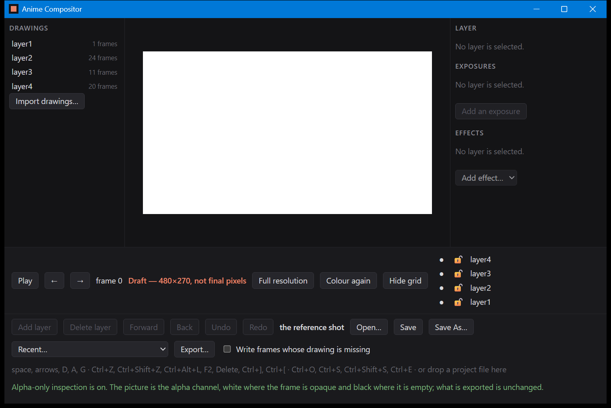

# B-12a: the alpha view, in the window

One photograph, of the control that `verification/B-12a_inspect_table.md` measures. The table is
where the pixels are checked; this is where the button, the keystroke and the sentence are, and no
test can see any of the three.

## Alpha-only inspection, on

Taken by `tools/capture_window.ps1 -Name B-12a_alpha_view -Keys 'a'`: the window opened on the
reference shot and one key was pressed. What that key did is along the bottom, in the window's own
words:

> Alpha-only inspection is on. The picture is the alpha channel, white where the frame is opaque
> and black where it is empty; what is exported is unchanged.

Two buttons are new beside the resolution toggle. **Colour again** turns the alpha view off, and
**Hide grid** turns off the transparency grid; each says what pressing it will do rather than what
is currently on, and each has a single-letter key — **A** and **G**, listed in the hint line with
the D that switches resolution. They are single letters and not accelerators because neither
changes the project: a person switches between these views constantly while judging one edge, and
nothing they do here can be undone because nothing they do here is a change.

**The picture is white because the reference shot is opaque.** Every pixel of frame 0 is covered
by the background layer, so its alpha channel is white everywhere, and that is the correct answer
rather than a blank canvas: the frame number, the resolution indicator and the draft warning are
all still standing beside it, so it is the shot that is being shown and not nothing. This is
exactly why the table does not use the reference shot for its measurements. It draws four pixels
of half-transparent red instead, where a wrong answer looks different from a right one, and checks
that the middle of the range comes back as the grey half way up:

| what is drawn | what the alpha view shows |
|---|---|
| red at alpha 128 | 128, 128, 128, 255 |

## What is not photographed

The transparency grid. It is behind a frame this shot fills completely, so a photograph of this
project with the grid on and one with it off are the same photograph. The grid is in every other
picture of this window, around the frames that do not fill it.

The alpha view of a shot with a soft edge, which is the picture that would show the difference
between an alpha channel and a silhouette. This build has no shot like that; the reference shot is
cel work, where a pixel is drawn or is not.
