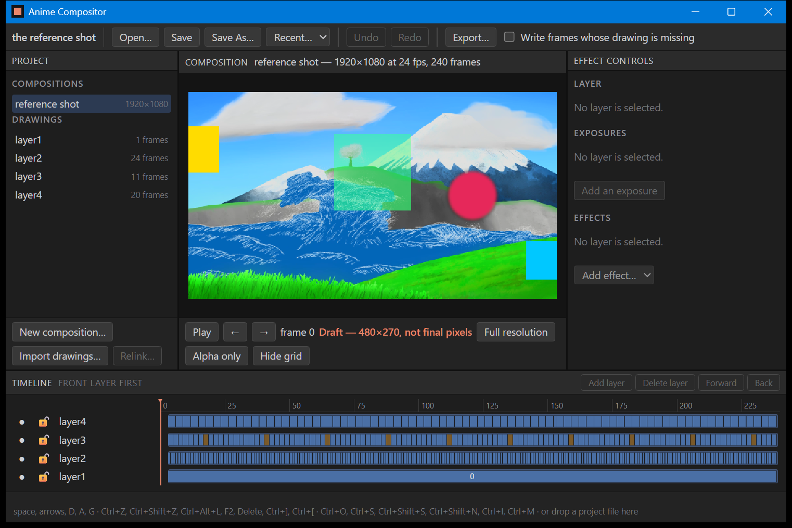
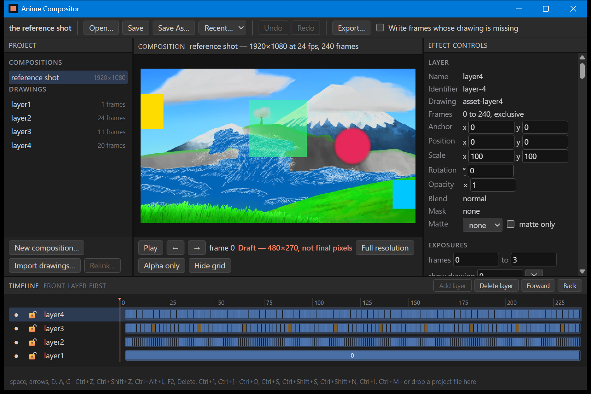
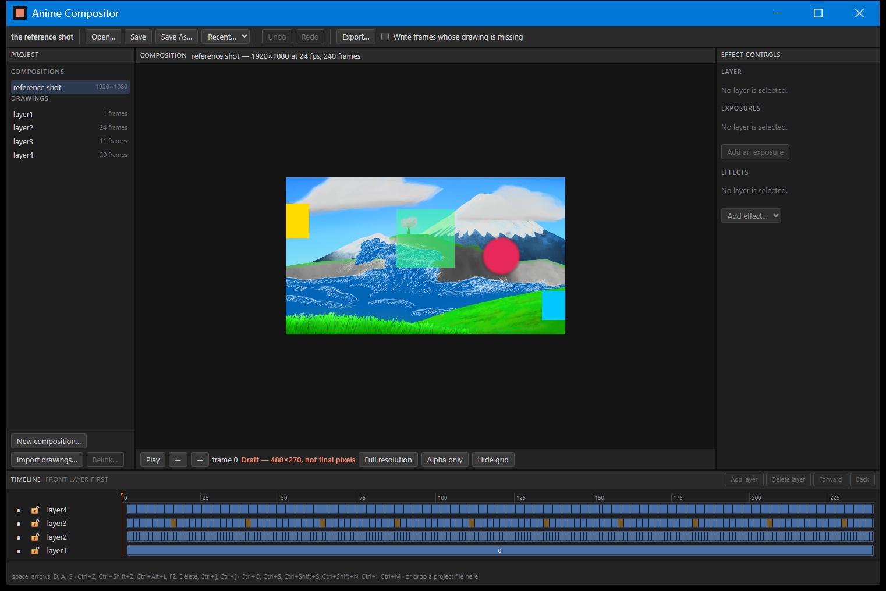
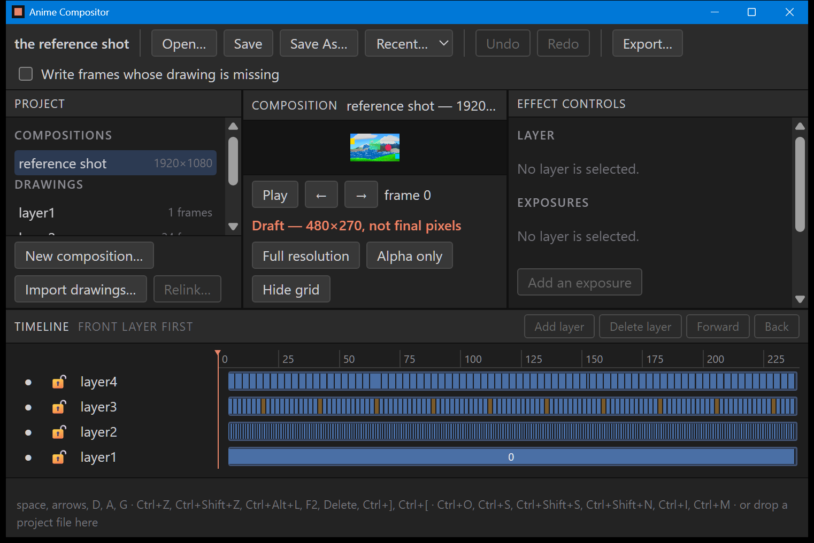
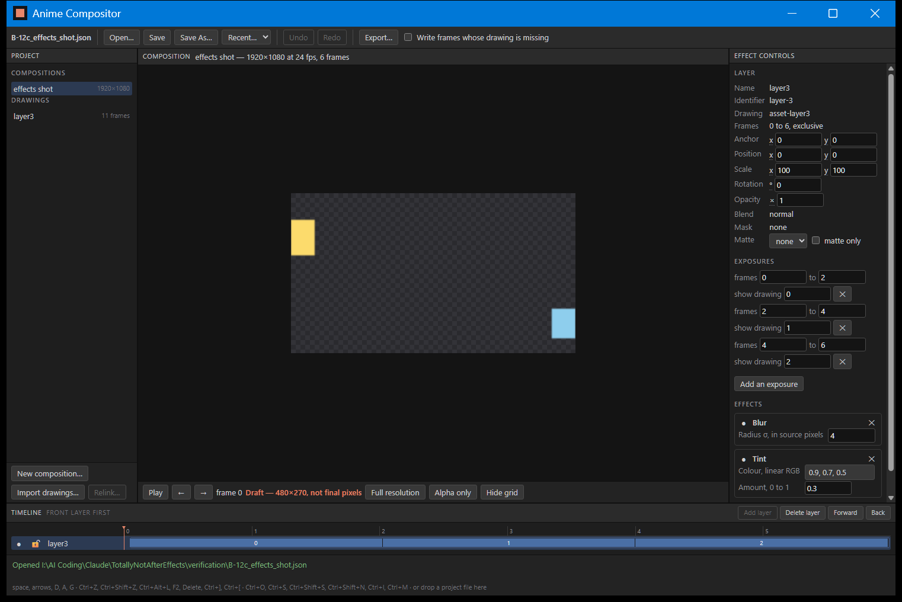

# B-12a, the editing window: what it looks like, and using it without a mouse

The eight tables under `B-12a_*_table.md` say that every command the editing panels invoke does
what it claims. None of them can say that the panels are on the screen, laid out, and operable.
That is what these five photographs are for, and Q-03 — display scaling and keyboard
reachability — is the requirement they answer for this window. Four defects were found here and
all four are fixed.

**Retaken twice on 2026-09-08, first under B-12c and then under B-12d.** A photograph is the one
artifact in this repository that no test regenerates, so a photograph of a window that no longer
exists goes on looking right, and both retakes were for that reason.

The B-12c retake found the four older pictures stale in a way worth naming: their keyboard hint
line still read `Ctrl+E` for the export, which document 24 names as `Ctrl+M` and the nineteenth
hardening pass corrected in the page months after the pictures were taken. It also found the
second and third defects below.

The B-12d retake was needed because B-12d put a COMPOSITION section and a **New composition…**
button at the top of the left-hand column, which is a new stop on the Tab order ahead of
everything else. Every count on this page went up by one, and every count was re-checked against
the picture rather than adjusted on paper.

## 1. The five panels



The reference shot, no project opened, nothing selected. Document 24's five areas are all
present at once, which is the claim:

| Area | Where | What it shows here |
| --- | --- | --- |
| the composition and the media bin | left | the composition on screen with its size, rate and length, **New composition…**, then layer1 to layer4 with their frame counts, **Import drawings…**, **Relink drawings…** |
| the viewer | centre | frame 0 of the reference shot, composited |
| the inspectors | right | LAYER, EXPOSURES, EFFECTS, each saying "No layer is selected." |
| the transport | below the viewer | Play, the two step arrows, the frame number, the draft warning, Full resolution, Alpha only, Hide grid |
| the layer list and the document bar | bottom | layer4 down to layer1 with their eye and lock buttons, then Add layer through Export… and the keyboard hint |

Two things in it are worth reading rather than glancing at. **Relink drawings… is greyed out**,
because nothing in the bin is selected and W-02 relinks a chosen sequence, not whatever was last
touched. And the inspectors say *No layer is selected* rather than showing empty fields, so an
empty box is never mistaken for a value of zero.

## 2. The keyboard alone



Twenty presses of Tab and then a space, no mouse at any point. The twentieth stop is layer4 in the
timeline, the space chooses it, and the LAYER panel fills in on the right: Name, Identifier,
Drawing, Frames, Anchor, Position, Scale, Rotation, Opacity, Blend, Mask, Matte. The transform
inspector being populated is the evidence — it is only ever populated for a selected layer.

```
powershell -ExecutionPolicy Bypass -Command "& ./tools/capture_window.ps1 -Name B-12a_keyboard -Keys (([char]9).ToString()*20 + ' ')"
```

Twenty rather than the thirteen this said before the restyle of 2026-09-08, and the extra seven
are all list rows and panel order rather than new controls: Open…, Save, Save As…, Recent…,
Export…, the *Write frames whose drawing is missing* checkbox, the one composition row, the four
drawing rows, New composition…, Import drawings…, Play, ←, →, Full resolution, Alpha only, Hide
grid, and then layer4 at the top of the timeline, which now sits below the three panels instead of
beside them. The count went from thirteen to twelve once before that, when it turned out a
disabled button is not a stop on the Tab order and Relink drawings…, Add an exposure and Add
effect… are all disabled while nothing is selected. The count is a property of the window in this
state, not a promise, and it is read off the picture each time rather than reasoned about — see
B-11 on why that matters: the capture tool drops a keystroke often enough that a count taken on
trust is wrong sooner or later.

**The defect this found, and the fix.** The rows in the layer list and the media bin were
reachable by Tab and showed a focus ring, so they looked keyboard-operable. They were not: a row
is chosen by clicking it, and nothing answered a key, so a person navigating by keyboard could
walk onto a layer and then have no way to select it. Reachable is not the same as usable. Both
lists are built by one `row()` function in `app/ui/index.html`, so one handler there fixes both:
Enter and Space now do what the mouse does. B-11's rule that a focused control keeps the keys it
is given is what makes the space bar select the row instead of starting playback.

**The second defect, found by retaking this photograph.** The space bar did both. The first
version of this picture, taken on 2026-09-08 against the build of that day, shows layer4 selected
*and* the shot playing — Pause on the transport, frame 37, and a line about dropped frames along
the bottom. The row's own handler chose the row and prevented the default; the accelerators are a
listener on the window, the event reached them afterwards as it bubbled, and nothing there asked
whether the key had already been answered. The search that lets a focused control keep the space
bar looks for a button, a select, an input or a drag handle, and a row is an `li`, which it
cannot match without matching everything. One line fixes it: a key whose default has already been
prevented is finished with, and the accelerators leave it alone. The picture above is the same
twelve presses against the build with that line in it.

## 3. Display scaling

| Photograph | Scale | What holds |
| --- | --- | --- |
|  | 100% | the five panels side by side, the document bar on one row |
|  | 200% | the same five panels; the rows of controls wrap, the inspector column scrolls, and the picture shrinks rather than being cut |

Same shot, same frame, in both. What to check going from one to the other: every panel is still
there, nothing overlaps anything, and the composited picture is whole. At 200% the document bar
wraps to two rows, the viewer's own controls wrap to three, the right-hand column is taller than
the room it has and grows a scroll bar — EFFECTS is below the bottom edge of it — and the
composition's name in the centre tab is shortened to *reference shot — 1920…* with an ellipsis.
All of that is the intended behaviour and not a defect: the fix made for B-11 was that the bars
keep at most half the window and scroll or wrap the rest, so the thing being composited is never
what gets pushed off. The picture at 200% is a third the size it is at 100%, which is the same
rule seen from the other side.

**The fourth defect, found by retaking this photograph.** At 200% the centre panel painted
straight over the inspector beside it, and *COMPOSITION reference shot — 1920×10*, *Draft — 48*
and *Hide g* were all cut off with nothing to scroll to reach them. Two things were wrong. The
three columns of `#work` were fixed at 220px and 280px on the outside, which at 200% left the
middle one no room at all; they may now all give ground. And each panel is a grid whose column
was left implicit, which makes it an `auto` track — and an auto track sizes itself to its widest
item before it sizes itself to its container, so the panel grew as wide as its row of buttons
wanted and the buttons were clipped instead of wrapping. That is the same trap the rows of this
same grid already carried a comment about, one axis over. Both are in `app/ui/index.html` with
the reason written beside them.

This one is worth naming for how it was missed rather than for what it was. `tools/capture_window.ps1`
photographs the built executable and does not build it, and Tauri compiles `app/ui/` into that
executable, so the first two attempts at this fix were photographed against a binary that did not
contain them and both looked like failures. A photograph of this window says nothing about a page
that has not been rebuilt into it.

```
powershell -ExecutionPolicy Bypass -File tools/capture_window.ps1 -Name B-12a_scale_100 -Scale 1.0
powershell -ExecutionPolicy Bypass -File tools/capture_window.ps1 -Name B-12a_scale_200 -Scale 2.0
```

As B-11 records, `-Scale` is not the same as changing the Windows display setting — it renders
the interface at that factor inside a window the operating system still sizes at this machine's
150%, so 200% here is a harsher test than a real 200% display, and the title bar is unaffected
because nothing in this repository draws it.

## 4. A layer's inspector, with effects on it



The three inspectors with something in them, which the four pictures above never showed: every
one of them was taken with the reference shot, where layer4 has eighty exposure spans and
EFFECTS is a long way below the bottom of the column. This is a small project made for the
photograph and kept beside it: `B-12c_effects_shot.json`, one layer pointing at the reference
shot's own layer3 drawings in `Fixtures/`, six frames on twos, with a blur and a tint on it,
captured at 100% so the whole column fits in one picture. Seventeen presses of Tab reach the layer
row and the space chooses it.

What it shows, top to bottom: LAYER with the transform fields and the matte chooser; EXPOSURES as
the layer's three spans, each wrapped over two lines — *frames 0 to 2* / *show drawing 0*, then
2 to 4 showing drawing 1, then 4 to 6 showing drawing 2, which is one drawing held for two frames,
three times over; and EFFECTS as the two effects in the order they are applied, each with its own
settings — **Blur**, *Radius σ, in source pixels*, 4; **Tint**, *Colour, linear RGB*,
0.9, 0.7, 0.5 and *Amount, 0 to 1*, 0.3. The dot beside a name is its
bypass toggle and the ✕ removes it. The values are the ones in the project file, which is what
makes this a check rather than a picture: the file says `sigma_px: 4.0` and the panel says 4.

**The third defect, found here.** An exposure row would not wrap. It is a flex row of *frames*,
two numbers, *show drawing*, a number and a ✕, and in a column this narrow it was wider than the
room it had, so the whole inspector grew a horizontal scroll bar and every row read *frames 0 to
2, sh…* with the drawing number off the edge. A person could not see which drawing a span shows
without scrolling the panel sideways, which is the one thing an exposure sheet is for. The row
now wraps onto a second line, which is why each one reads across two lines above.

```
powershell -ExecutionPolicy Bypass -Command "& ./tools/capture_window.ps1 -Name B-12c_effects_panel -Open 'verification/B-12c_effects_shot.json' -Scale 1.0 -Keys (([char]9).ToString()*17 + ' ')"
```

## What these five do not cover

- **The Open, Save As and Import dialogs.** Windows draws them and the capture script has no
  hands to answer one. The whole relink and import flow is therefore photographed only up to the
  point the dialog opens; what happens after it is in `B-12a_media_table.md` and
  `B-12a_relink_table.md`, driven by the same command the dialog would have invoked.
- **`app/ui/index.html` itself.** No test exercises the page — the tables reach the commands
  directly. These photographs are the only check that the page invokes them, and they cover one
  path through it. B-12, the owner's acceptance run of W-01 and W-02, is what covers the rest.
- **Screen readers and high-contrast mode.** Nothing here has been checked against either, and no
  requirement asks for it yet.
- **A real change of the Windows display setting**, which needs a sign-out and a person.

All five were captured at 1522×1016 physical pixels, the size a 1000×640 window has on this
display running at 150%. Like every photograph under `verification/`, these are made by `tools/capture_window.ps1`
and not by `cargo test`, so no test regenerates them and nothing can disagree with them; window
placement, the desktop behind the window and the title bar theme belong to the machine and the
moment.
