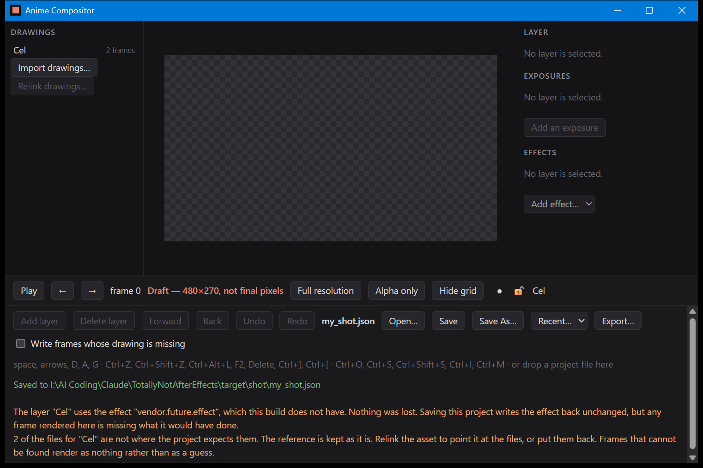

# B-12b: the defect the page table found on its first run

`my_shot.json` open, `Ctrl+S` pressed, and the status line in green reads **Saved to
I:\AI Coding\Claude\TotallyNotAfterEffects\target\shot\my_shot.json**. That is a photograph of an
ordinary save, and the reason it is worth keeping is that the same photograph taken before this
commit would have said *Which layer? Choose one in the layer list.*

## What was broken

Every route the window answers itself — **Open, Save, Save As, Export, the recent list and
recovery** — was unreachable in the built application.

`fn command` offers each request to `edit_command` first, and reads `None` as "this is not a
command, try the routes". `edit_command` never returned `None` for a request that named no layer.
An identifier it had never heard of fell past the commands it does answer, reached the layer
lookup at the bottom of the function, found no `layer` parameter and answered *Which layer?
Choose one in the layer list.* — which is a sentence, which is `Some`. So `/save` was answered by
the command layer with a refusal about layers and never reached the save.

## Why nothing caught it

Every test in this project that saves, opens or exports calls `save`, `open` or `start_export`
directly. Only the window goes through `fn command`, and until now nothing tested the window's
routing at all. `verification/HARDENING_mutation_report.md` named this exact hole when B-12a was
hardened — *"the page has no test at all"* — and this is what was in it.

It also means B-12, the owner's acceptance run, would have failed on step twelve of thirteen:
save, close, reopen. The whole editing window worked and the file could not be written.

## The fix

`edit_command` now begins with the list of identifiers it answers and returns `None` for
everything else, which is what `fn command` was always reading it as saying. The list is not
free-floating: `verification/B-12b_page_table.md` checks that every identifier the page sends is
in it, and `verification/B-12b_command_map_table.md` checks that nothing outside it is answered,
so an identifier added to one side and not the other fails a table rather than a person.

## What this photograph does not cover

The Save As, Open, Import, Relink and Export dialogs, which Windows draws and no script can
answer. What is shown here is a save to a path the project already had, which is the one of the
six that needs no dialog. The other five reach the same `match` arm through the same `None` and
are checked by name in the page table, not photographed.
