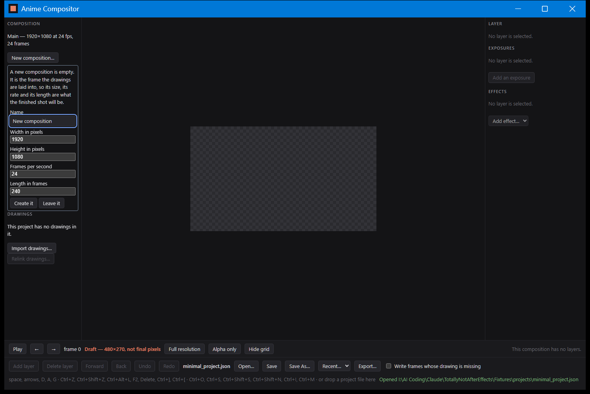

# B-12d: the New composition control, photographed

`verification/B-12d_new_composition_table.md` says that `composition.create` does what it claims.
It cannot say that the control is on the screen, that it can be reached without a mouse, or that a
person is told what a new composition is before they are asked to describe one. That is what this
photograph is for.



`Fixtures/projects/minimal_project.json` — a project whose one composition is empty, which is the
state this command exists for — with **Ctrl+Shift+N** pressed and nothing else touched.

```
powershell -ExecutionPolicy Bypass -File tools/capture_window.ps1 -Name B-12d_new_composition -Open "Fixtures/projects/minimal_project.json" -Ctrl -Shift -Keys "n" -Scale 1.0
```

Six things in it are the claim rather than decoration.

**COMPOSITION is the first thing in the window**, above DRAWINGS, and the line under it says which
composition is on screen — *Main — 1920×1080 at 24 fps, 24 frames*. Before B-12d nothing in the
window said which composition you were in, because there was only ever one and it never changed.
Once a person can make a second one, a window that does not say which one they are looking at is a
window they can get lost in.

**Ctrl+Shift+N opened the fields and put the keyboard in the Name field.** No mouse was used to
take this picture. Ctrl+Shift+N rather than Ctrl+N is document 24's row and the reason is written
beside it: Ctrl+N belongs to `project.new`, which this build does not have, and taking its shortcut
now would have to be given back later.

**The paragraph above the fields.** *A new composition is empty. It is the frame the drawings are
laid into, so its size, its rate and its length are what the finished shot will be.* The owner has
said the vocabulary of this application is not obvious from outside it, and "composition" is the
word that carries the most assumed knowledge in document 24. It is explained where it is asked
for, not in a manual.

**Five fields, all filled in.** 1920 by 1080 at 24 fps for 240 frames — the reference shot's own
shape. Somebody who does not know what to answer can press *Create it* and get something sensible.
Whether these are the right defaults, and whether five fields is too many to be asked at once, is
one of the things the acceptance run is meant to report back.

**Create it and Leave it**, rather than *OK* and *Cancel*. *Leave it* closes the fields and makes
nothing, which is the answer somebody who opened this by mistake wants.

**The keyboard hint along the bottom now lists Ctrl+Shift+N.** That strip is how the shortcuts in
this window are discovered — there is no menu bar — so a shortcut missing from it is a shortcut
nobody finds.

## What this does not cover

- **What the window looks like after *Create it*.** The capture script presses keys and takes one
  picture; it cannot press a button in a dialog it opened and photograph the result. What the
  window shows afterwards — the composition line changing, the picture going empty, the sentence
  saying it is empty — is checked in `verification/B-12d_new_composition_table.md` instead, and is
  step 3 of the run sheet the owner walks in front of the real window.
- **The refusals.** A zero width, an impossible size and an impossible length are all turned down
  in a sentence, and those sentences are in the table. None of them is photographed.
- **Display scaling.** This is at 1.0. `verification/B-12a_window_and_keyboard.md` covers 100% and
  200% for the window as a whole, and its pictures were retaken after this control was added.

Captured at 1522×1016 physical pixels, the size a 1000×640 window has on this display running at
150%. Like every photograph under `verification/`, this one is made by `tools/capture_window.ps1`
and not by `cargo test`, so no test regenerates it and nothing can disagree with it; window
placement, the desktop behind the window and the title bar theme belong to the machine and the
moment.
