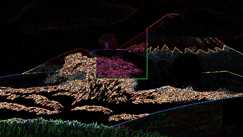
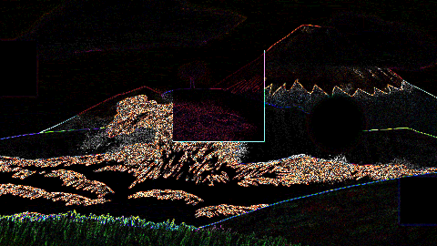

# P-06: what draft-resolution cels cost, and what they change

Written by `p06_draft_cels_cost` in `tests/p06_draft_cels.rs`, `#[ignore]`d and run deliberately in release. **Nothing in `src/` changes**: document 15 scopes P-06 as "a branch that is measured and not merged", and the whole quarter-resolution path lives in that one test file. This page is the deliverable. It exists to let the owner see the cost and decide, not to argue for it.

- CPU: AMD Ryzen 9 9900X, 12 cores, 24 hardware threads
- OS: Microsoft Windows 11 Education, 10.0.26200
- Toolchain: rustc 1.89.0, cargo release profile, `opt-level = 3`
- Date: 2026-09-10

## What was changed

Draft quality reduces the composite to 480 by 270 and decodes every cel at 1920 by 1080 anyway. Held at a quarter on each side, a cel is one sixteenth of the bytes, and the layer's transform carries the difference:

- **today**: `source(1920x1080)` then `T` then `S(1/4)`, into a 480x270 frame;
- **measured here**: `source(480x270)` then `S(4)` then `T` then `S(1/4)`, into the same frame.

The reduction is an exact 4x4 box average **in premultiplied linear light**, the space the working buffer is already in, so no colour conversion and no alpha division happens on the way.

## The frame time

The tile loop only, four frames each, the two renders alternating frame by frame so that neither pays the other's cold cache. The last column is what it costs to reduce one frame's cels once — work a cache would do on the decode, not on every frame, and it is listed because a cache that cannot hold the shot pays it again on every eviction.

| Fixture | Draft today (ms) | Draft with quarter cels (ms) | Change | Reducing one frame's cels (ms) | Frames before that pays for itself |
|---|---|---|---|---|---|
| reference shot | 1.914 | 1.007 | -47.4% | 42.3 | 47 frames |
| declared fixture | 4.141 | 1.944 | -53.1% | 135.5 | 62 frames |

## The bytes

Every distinct drawing the fixture names, at 1920x1080 RGBA f32 against the same drawing at 480x270. D-40 sets the cache budget at 1 GiB.

| Fixture | Distinct drawings | Held at full | Held at a quarter |
|---|---|---|---|
| reference shot | 56 | 1.73 GiB | 0.11 GiB |
| declared fixture | 166 | 5.13 GiB | 0.32 GiB |

## The difference, which is the point

Downsampling then transforming is not transforming then downsampling. Each row is one draft frame of 129,600 pixels, encoded to the eight bits a viewer sees and compared against the draft frame this build produces today.

| Fixture | Frame | Pixels that differ | Largest difference of 255 | Mean over all channels |
|---|---|---|---|---|
| reference shot | 0 | 67270 | 46 | 1.0714 |
| reference shot | 14 | 70168 | 45 | 1.1131 |
| reference shot | 100 | 67719 | 45 | 0.9402 |
| reference shot | 239 | 67060 | 43 | 1.0088 |
| **reference shot, frame 0** | pictured below | `P-06_reference_shot_today.png`, `P-06_reference_shot_quarter.png`, `P-06_reference_shot_difference.png` | |
| declared fixture | 0 | 66055 | 93 | 1.0365 |
| declared fixture | 14 | 68084 | 45 | 1.0935 |
| declared fixture | 100 | 66786 | 78 | 0.8530 |
| declared fixture | 239 | 65837 | 43 | 0.9431 |
| **declared fixture, frame 0** | pictured below | `P-06_declared_fixture_today.png`, `P-06_declared_fixture_quarter.png`, `P-06_declared_fixture_difference.png` | |

The pictures are the frame that differs most on each fixture: the draft frame as it is today, the same frame with quarter cels, and the difference between them **amplified sixteen times on opaque black**, because a difference of one or two code values is invisible beside the picture it came from.

## Reading the numbers

Facts, not a recommendation.

- **The tile loop gets about half its time back.** Both fixtures render a draft frame in roughly half the time once the cels are already reduced.
- **Reducing a cel costs far more than one frame's saving.** The last two columns of the first table are the whole arithmetic: reducing a frame's cels is tens of milliseconds, the saving is one or two, so this is only ever a saving if a reduced cel is held and reused over many frames. On a cache miss it is a loss.
- **It is the bytes, not the milliseconds, that move.** Held at full, one pass over either fixture wants more than D-40's 1 GiB; held at a quarter, both fit several times over. A cache that fits is a cache that stops missing, which is where the frame time above actually comes from.
- **The picture changes, and not subtly.** More than half the pixels of every draft frame differ. The difference pictures show where: edges and fine detail, with flat areas black. Averaging sixteen source pixels is not the same as taking one bilinear sample of them, and at a quarter scale that gap is the aliasing the current draft frame has and the reduced one does not. Which of the two is *correct* is not a question this measurement can answer.

## The export

ADR-015 keeps the cache off the export path — `plan_frame` and `crate::export` pass `CelCache::none()` — so an export cannot see a reduced cel by construction. Checked anyway: the same frames exported before any of the work above, and again after all of it.

| Fixture | Frames exported twice | Encoded bytes |
|---|---|---|
| reference shot | 4 | byte-identical |
| declared fixture | 4 | byte-identical |

## What this does not decide

Document 15: this "cannot be built without a register entry first". The pixels on the preview path change, which makes it a specification question. D-33 already puts the preview at draft by default and requires the viewer to say when the preview differs from export; whether that sentence covers this difference is the owner's to say, in document 14, before any of this lands.
