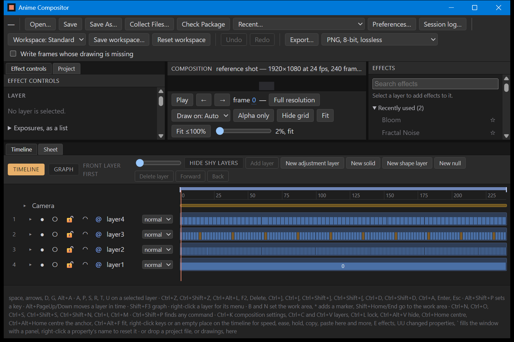

# W-31a: the timeline, redesigned (a proposal)

Written on 2026-09-28, the first screen of the redesign (D-175, D-176 proposed). Nothing in the
program has changed yet. These are drawings of how the timeline would look, for you to accept or
change before it is built as W-31b.

The drawings are `design/W-31_timeline.html`, which opens in any browser. The layers in them are
made up to show all four kinds of timing at once: on 1s, on 2s, irregular, and one drawing held.

## Today

## Proposed

At 200 per cent display scaling:

## What changes

1. **One header row, not three.** It holds:
   - the Timeline and Graph switch;
   - the frame you are on, in large type, with seconds and frames beside it;
   - **New layer**;
   - **Hide shy**;
   - the zoom, with the frames in view written beside it.

   The Timeline and Graph buttons stop being orange, so they no longer look like a second row of
   panel tabs. The words "front layer first" go, because the numbered # column already says it.
2. **Five buttons become one New layer menu:** drawings, adjustment layer, solid, shape layer and
   null, each with its shortcut shown. Drawings is greyed until you choose drawings in the Project
   panel, and the menu says so.
3. **The Delete layer, Forward and Back buttons leave the header.** They are still:
   - on the layer's right-click menu (Delete, Bring to front, Send to back);
   - on Delete, Ctrl+] and Ctrl+[;
   - in the command finder, Ctrl+Shift+P.
4. **Headings over the columns**: show, solo, lock, #, layer, shy, mode and parent. Each is an
   icon with its name when you point at it.
5. **One set of icons for the switches.** Today they are a mix of dots, circles and a coloured
   lock picture. The words that say a layer is hidden, soloed, locked or shy stay as they are.
6. **A timing tag beside each layer's name**: *on 1s*, *on 2s*, *irregular* or *held*. It is
   read off the layer's exposures and changes nothing.
7. **Drawings on the bar are easier to count:**
   - Two shades alternate, so every change of drawing shows even where there is no room for the
     number.
   - The number is written wherever it fits.
   - A single held drawing is one long green bar.
   - A layer's keyframes are small marks along the lower edge of its bar, clear of the drawing
     numbers. Opening the layer (A, P, S, R, T, U) shows each property's keys on its own line, as
     today.
8. **A missing drawing is striped red and says "missing"**, where today it is brown. The row
   gets a red **Relink…** button, so the fix is next to the problem (document 05's
   missing-media state).
9. **The ruler marks seconds** ("1s · 24") as well as every sixth frame. The playhead carries its
   frame number in a red flag.
10. **Mode and parent read as quiet text** rather than big boxes. A mode other than Normal is
    orange, so it stands out.
11. **An empty composition says so and offers the two ways to start**: Import drawings (Ctrl+I),
    New layer, or dropping a folder of drawings on the window.
12. **The layer columns take at most 45 per cent of the panel's width**, so at 200 per cent the
    drawings keep more than half of it. Today they take a fixed 340 pixels at every size.

## What does not change

- Every command the timeline sends, so document 24 is unchanged.
- Every shortcut.
- Every right-click menu.
- Every drag:
  - moving and trimming bars;
  - retiming at a seam;
  - reordering rows;
  - the work area and markers;
  - dragging keys.
- The Graph's contents and the Sheet panel.
- The row of shortcuts along the bottom of the window stays until W-37 replaces it with the
  shortcut list.

## The order after this (D-176, proposed)

| Item | Screen |
|---|---|
| W-31 | The timeline (this sheet) |
| W-32 | The Sheet and the exposure list: D-64's overhaul |
| W-33 | The viewer and its controls |
| W-34 | Effect controls, the layer's panel |
| W-35 | The Project and Effects panels |
| W-36 | The strip along the top and the status strip, with document 05's states: an empty project, an export running and failed, unsaved changes, recovery |
| W-37 | The keyboard shortcut list and its editor |

Each one works the same way: pictures first, then the build, then a playtest. G4 passes when you
accept W-37's playtest and have made a real shot with the tool (A-02).

## What to answer

"accept", or the numbers above you want changed and how. You can also change the order of the
screens.
