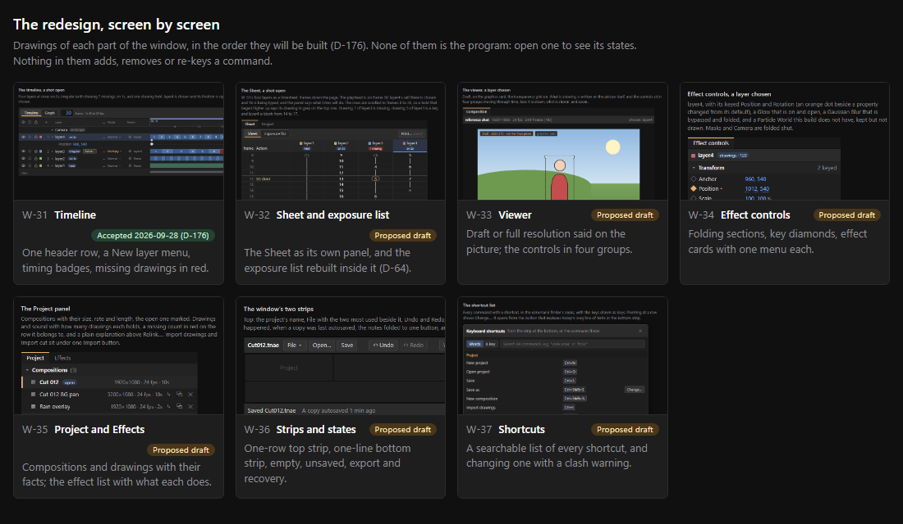
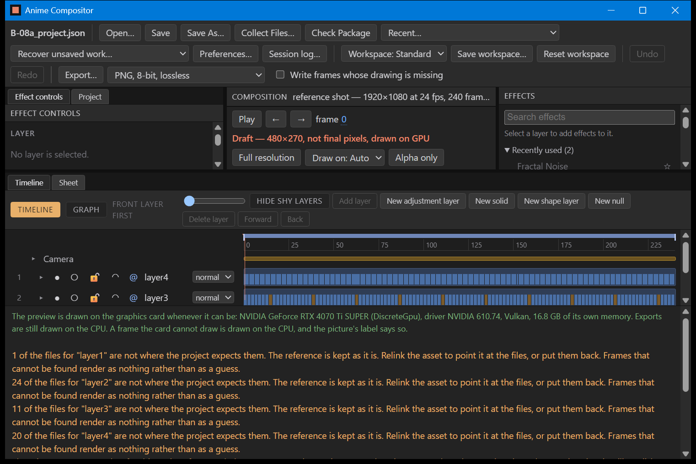

# W-32 to W-37: the rest of the window, redesigned (proposed drafts)

Written on 2026-09-28, after you accepted the timeline (W-31, D-176). Nothing in the program has
changed. These are drawings of how each remaining part of the window would look, in the order
D-176 set, for you to accept or change one at a time before each is built.

Every drawing is a file in `design/` that opens in any browser. `design/index.html` shows them all
on one page, with a picture of each:

The layers, drawings, paths and times in the drawings are made up.

## Today

This picture was taken from the program before any of this work, and is the "before" for every
screen below.

## W-32: the Sheet and the exposure list

File: `design/W-32_sheet.html`

At 200 per cent display scaling:

### What changes

1. **The Sheet is its own panel, with two views:** the timesheet grid and the exposure list. A
   switch at the top moves between them. Print… (Ctrl+P) stays in the panel's header.
2. **Each layer's column head says its timing:** its colour, its name, and a badge such as
   "on 2s". A layer with a missing drawing says "1 missing" there in red. The chosen layer's
   column is lit.
3. **What you are about to do is written out.** When you type a number in a cell, a line under it
   says, for example, "Enter writes drawing 16 on frame 30, lasting until the next mark below it."
4. **A hold that started above the part you can see says its drawing** in grey on the top row, so
   a scrolled Sheet never shows a line with no number.
5. **Missing drawings are red** on the cell and on their hold line. Keys are circled, as on paper.
6. **The exposure list is rebuilt (D-64)** and moves here from the folded "Exposures, as a list"
   under Effect controls:
   - a summary line: how many exposures, and how long each drawing is held, for example
     "3f×16" (sixteen drawings held three frames);
   - one row per exposure: number, drawing, first frame, last frame, how many frames, and a small
     bar showing where it sits in the shot;
   - a missing drawing's row is red with Relink… on it;
   - the row under the playhead is marked;
   - "+ Add an exposure" says what it will add, for example "drawing 24, from frame 73".
7. **An empty composition** says why the Sheet is empty and offers the two ways to bring drawings
   in.

## W-33: the viewer

File: `design/W-33_viewer.html`

### What changes

1. **The picture says what it is.** A tag on it reads "Draft · 480×270 · not the final pixels" in
   orange, or "Full resolution · 1920×1080 · the export's pixels" in green.
2. **The header names the composition** and its size, rate and length, and which layer is chosen.
3. **The controls sit in four groups:**
   - moving through time: previous, Play, next, and the frame with its seconds;
   - how it is drawn: Draft or Full (D), and Draw on;
   - what is shown: Alpha (Alt+A) and the transparency grid (Alt+G);
   - zoom: Fit (Shift+/), Fit ≤100%, the slider and the percentage.
4. **While playing,** a red tag says so and Play becomes Pause. When it stops, a line says how
   many frames were skipped to keep time.
5. **Alpha only is labelled** "white is solid, black is see-through", so it is never mistaken for
   the shot.
6. **A frame with a missing drawing says so on the picture,** with Relink… right there.
7. **When the viewer is narrow, the groups wrap whole,** so Play never lands on a different line
   from the frame number.

## W-34: Effect controls

File: `design/W-34_effect_controls.html`

At 200 per cent display scaling:

### What changes

1. **The panel is in sections that fold:** Transform, Layer, Masks, Effects and Camera. Each
   heading says how many things are inside, for example "Effects (3)".
2. **Every animatable property has its key diamond in one column:**
   - filled: a key on this frame;
   - outlined in orange: keyed, but not on this frame;
   - grey: not keyed.

   Values are blue, as in the timeline. A small orange dot marks a property changed from its
   default, the same thing UU shows.
3. **Layer facts are grouped:** its drawings, its frames, blend, parent, matte, and its timing
   badge, with a link to the exposure list in the Sheet.
4. **Each effect is a card:**
   - a grip to drag it;
   - its on/bypass tick;
   - its name;
   - a ⋯ button.

   A bypassed effect is dimmed and says "bypassed".
5. **The ⋯ menu collects what an effect's small buttons and its right-click menu do today:** move
   earlier, move later, bypass, copy, copy all, paste, save as a preset, and delete. Right-click
   still opens it.
6. **An effect this build does not have** is marked "not in this build", kept, and not drawn.
7. **Add effect… shows Ctrl+Space** beside it.
8. **Camera sits last and says it is the composition's,** not the layer's. It stays when no layer
   is chosen.
9. **With nothing chosen,** the panel says how to choose a layer. **A null** keeps its Transform
   and says why it has no effects.

## W-35: the Project and Effects panels

File: `design/W-35_project_effects.html`

### What changes

1. **Each composition shows its size, rate and length**, for example "1920×1080 · 24 fps · 10s".
   The open one is marked. Add as a layer, Duplicate and Delete stay on each row.
2. **Each drawings row shows how many drawings it holds.** A row with missing drawings is red and
   says how many. The "Can be passed on" tick stays, shortened to "passed on".
3. **Missing drawings get a plain sentence above Relink…**, and the relink offer says what it
   found and where before it changes anything.
4. **Import drawings… and Import cut… share one Import button,** each with a line saying what it
   takes. New composition… shows Ctrl+Shift+N.
5. **The new composition form is a tidy grid,** with the length read back in seconds and frames.
   The Sheet's names (episode, scene, cut, animator) fold away until wanted.
6. **The Effects panel shows:**
   - Favourites, Recently used and Presets first;
   - then each effect family folded shut, with how many it holds;
   - under the search, which layer an effect goes on and how to add it.
7. **A search opens every family with a match** and shows what each effect does. Enter adds the
   first one, which is highlighted.
8. **With no layer chosen,** the list is dimmed and says what to do.

## W-36: the two strips, and the states

File: `design/W-36_strips_and_states.html`

### What changes

1. **The top strip becomes one row, in groups:**
   - the project's name;
   - File, with Open and Save beside it;
   - Undo and Redo;
   - the workspace;
   - the export on the right.
2. **A File menu** takes the rarely used buttons and lists: Recent, Collect Files, Check Package,
   Preferences, the Session log, and Recover unsaved work. Each is shown with its shortcut.
3. **A Workspace menu** holds the workspace list, Save workspace… and Reset workspace.
4. **"Write frames whose drawing is missing" only appears when a drawing is missing,** beside
   Export…, as "Write past missing drawings".
5. **The bottom strip is one line:**
   - what just happened;
   - when a copy was last autosaved;
   - the notes, folded into one button such as "3 notes: layer3 has 2 missing drawings, and more";
   - a Keyboard shortcuts button.

   The notes open above the strip when pressed, each with what it means for the picture. A missing
   drawing's note has Relink… on it. Error details stays.
6. **The long line of shortcut hints goes.** The Keyboard shortcuts button opens W-37's list in its
   place.
7. **Empty project:** the middle of the window says how to start. It offers New composition,
   Import drawings, Import cut, Open, the recent projects, and dropping files in.
8. **Unsaved changes:** a dot beside the name, and the bottom strip says it plainly, for example
   "a copy autosaved 1 min ago, beside the file · your file last saved at 14:02". No box asks you
   to save.
9. **Export running:** the frame it is on, how many are written, roughly how long is left, and
   Cancel export, where Export… was. The rest of the window keeps working.
10. **Export failed:**
    - why it stopped, in words;
    - which frames were written, and to which folder;
    - Relink…, or the tick to write past a missing drawing;
    - Error details.
11. **Recovery:** today it is a list in the top strip. Here it becomes a card in the middle of the
    window when a project has autosaved copies newer than its file:
    - your saved file is shown on its own, in green, with "Keep working on it";
    - the copies are listed below it, newest first, each with "Open this copy";
    - a line says that a copy opens as unsaved work, and your file changes only when you save.

## W-37: the shortcut list and its editor

File: `design/W-37_shortcuts.html`

At 200 per cent display scaling:

### What changes

1. **A Keyboard shortcuts window lists every command that has a shortcut,** in the command
   finder's areas: Project, Edit, New layers, Layers, Time, Keys, Properties, Timeline, Viewer,
   Tools, Finding and Sheet. The keys are drawn as keys.
2. **It searches two ways:** by words (for example "work area"), or by pressing a key to see what
   it does now.
3. **Change… on a row** lets you press new keys. If they are already taken, it says by what, and
   what will lose its shortcut:
   - Replace changes it;
   - Cancel keeps both as they were;
   - Reset puts back the default.
4. **A changed shortcut says so** and what it was. Reset all puts every one back. Changes are kept
   on this computer, not in the project.
5. **The Sheet's keys are marked** as working only while the Sheet has the focus.

## What does not change

- **Commands and shortcuts:** no command is added or removed, and no default shortcut changes.
  Document 24's commands and the command finder stay as they are. A button that moves into a menu
  keeps its shortcut and its name.
- **Pictures and files:** what any command does to the picture, the project file or an export stays
  the same.
- **Panels:** the panels, where they sit, and dragging or right-clicking a panel's name to move it
  all stay the same.

## The order after this

Each screen is built as its own step, in this order, once you accept it: W-32, W-33, W-34, W-35,
W-36, W-37. Each ends with a playtest sheet like the one W-31b will have.

## What to answer

For each of W-32 to W-37: **accept**, **change** (say what), or **not yet**. Or all at once, as
with W-31.

And three choices that are yours:

1. **The exposure list** moves out of Effect controls into the Sheet panel, as its second view.
   Its rows say the **last frame shown**, not today's "the frame it ends before". Yes, or keep
   either as today?
2. **The top strip:** Recent, Collect Files, Check Package, Preferences and the Session log go
   into a File menu, and Open and Save stay as buttons. Is there one you use often enough to keep
   as a button?
3. **Recovery:** today it is a list in the top strip. It becomes a card in the middle of the
   window, shown when you open a project that has newer autosaved copies. Yes?
